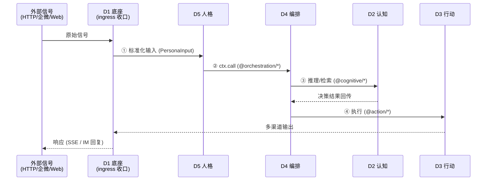
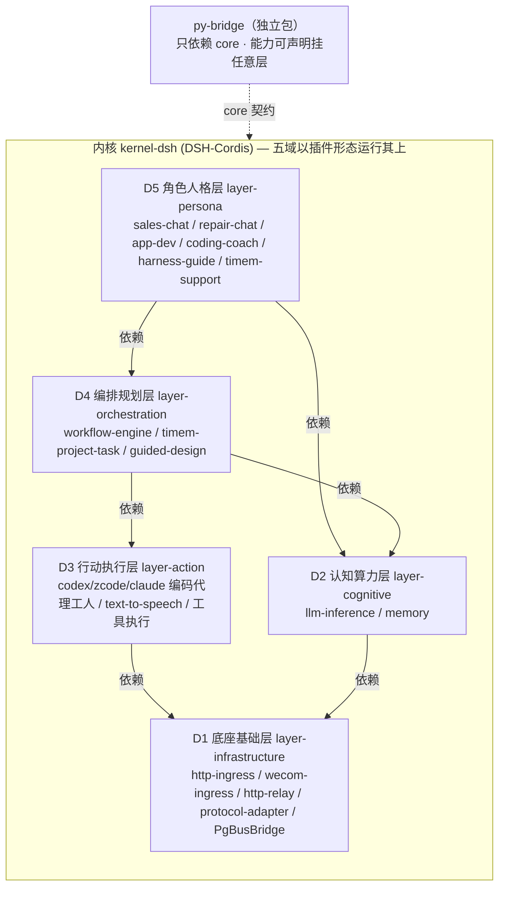

# aigility-harness

> **五域可插拔智能 Agent 架构** —— 一套可承载任何 LLM / 工具 / Agent / 内核的「Harness」工程范式。
>
> *A five-layer, fully-pluggable AI Agent harness: kernel-agnostic, contract-driven, hot-swappable.*

### 仓库镜像

| 平台 | 地址 |
|------|------|
| **GitHub**（全球主镜像） | https://github.com/AIGility-Cloud-Innovation/aigility-harness |
| **Gitea**（国内主镜像） | https://git.aigility.cloud/TiMEM-AI/aigility-harness |

双仓库同步维护，提交以 Gitea 为权威信源，GitHub fast-forward 同步。

### 总体架构（依赖序）

```text
┌────────────────────────────────────────────────────────────────────────┐
│                    aigility-harness 五域架构（依赖序）                 │
│           「契约是主体，插件是过客」— 一切可插拔                       │
│                                                                        │
│╔══════════════════════════════════════════════════════════════════╗    │
│║   内核 kernel-dsh (DSH-Cordis) — 五域全部以插件形态运行其上      ║    │
│║   KernelAdapter / Seam Registry / Event Bus / Carrier            ║    │
│╠══════════════════════════════════════════════════════════════════╣    │
│║  ┌──────────────────────────────────────────────────────────────┐║    │
│║  │D5 角色人格层 (layer-persona) — 与用户直接交互                │║    │
│║  │   sales-chat / repair-chat / app-dev / coding-coach          │║    │
│║  │   plugin-helper / advisory-chat / harness-guide / timem-*    │║    │
│║  └──────────────────────────────────────────────────────────────┘║    │
│║        │ 依赖 D4 + D2 + D1                                       ║    │
│║        ▼                                                         ║    │
│║  ┌──────────────────────────────────────────────────────────────┐║    │
│║  │D4 编排规划层 (layer-orchestration) — 小脑                    │║    │
│║  │   @orchestration/workflow-engine · 任务规划/引导设计          │║    │
│║  │   timem-project-task(需求缓冲延时汇总) · guided-design       │║    │
│║  └──────────────────────────────────────────────────────────────┘║    │
│║        │ 依赖 D3 + D2 + D1                                       ║    │
│║        ▼                                                         ║    │
│║  ┌──────────────────────────────────────────────────────────────┐║    │
│║  │D3 行动执行层 (layer-action) — 手脚                           │║    │
│║  │   @action/codex-agent/zcode-agent/claude-agent 编码工人      │║    │
│║  │   @action/text-to-speech · 工具执行 / 多渠道输出             │║    │
│║  └──────────────────────────────────────────────────────────────┘║    │
│║        │ 依赖 D1                                                 ║    │
│║        ▼                                                         ║    │
│║  ┌──────────────────────────────────────────────────────────────┐║    │
│║  │D2 认知算力层 (layer-cognitive) — 电站，D4/D5 共同依赖        │║    │
│║  │   @cognitive/llm-inference · @cognitive/memory               │║    │
│║  └──────────────────────────────────────────────────────────────┘║    │
│║        │ 依赖 D1                                                 ║    │
│║        ▼                                                         ║    │
│║  ┌──────────────────────────────────────────────────────────────┐║    │
│║  │D1 底座基础层 (layer-infrastructure) — 地基                   │║    │
│║  │   dependsOn:[] 最先加载 · 外部入口唯一收口（ingress）        │║    │
│║  │   http-ingress / wecom-ingress / protocol-adapter            │║    │
│║  │   http-relay(具名目标转发) / config / logging / PgBusBridge  │║    │
│║  └──────────────────────────────────────────────────────────────┘║    │
│╚══════════════════════════════════════════════════════════════════╝    │
│                                                                        │
│  ┌──────────────────────────────────────────────┐                      │
│  │ py-bridge（独立包，只依赖 core）             │                      │
│  │  声明式接入 Python 生态（aigility 等）；     │                      │
│  │  能力 ID 由 py-plugins.json 声明，可挂任意域 │                      │
│  └──────────────────────────────────────────────┘                      │
│                                                                        │
│外部接入: LLM 网关/LiteLLM ↔ D2 · TiMEM Engine ↔ timem 插件/@cognitive/*│
│          HTTP/企业微信/IM ↔ D1 入口 · Python 生态 ↔ py-bridge          │
│依赖方向: 每域只依赖比自己小的域号（D2→D1; D3→D1; D4→D1+D2+D3; D5→D1+D2+D4）      │
│调用时序: 外部信号 → D1 收口 → ①L5 → ②L4 → ③L2 → ④L3 → 响应             │
│          （调用流域号严格递减 5→4→2→3，与依赖序同向）        │
└────────────────────────────────────────────────────────────────────────┘
```

### 运行时调用时序（与依赖序解耦）

```text
外部信号 → D1 ingress 收口 → ① D5 人格 → ② D4 编排 → ③ D2 认知 → ④ D3 行动 → 响应
```



> 调用流（D5→D4→D2→D3）域号严格递减，与依赖序（每域只依赖更小域号）完全同向——
> 2026-09 人格/行动域号对调后，调用序与栈序不再 zigzag。

### 详细架构（Mermaid 依赖图）



> 依赖边按真实 DAG 绘制（源码 `LAYER_DESCRIPTORS.dependsOn`，2026-09 域号对调后）：
> 人格(D5) 依赖 编排(D4)+认知(D2)+底座(D1)；编排(D4) 依赖 行动(D3)+认知(D2)+底座(D1)；
> 行动(D3) 只依赖 底座(D1)；D1 无依赖、最先加载——每域只依赖更小域号。

---

## 一、定位：这是一套 Harness，不是某个 Agent

`aigility-harness` 是一套**可以插上任何东西**的智能体运行底座。现在框架上挂着的 Codex、LiteLLM、deepseek-v4-pro 等**都只是验证案例**——它们可以被同契约的任意实现一键替换，框架本身不依赖其中任何一个。

一句话总结本架构：

> **契约是主体，插件是过客。接口永久不变，实现任意替换。**

核心能力矩阵（四大组合创新 —— 业界没有开源框架完整提供）：

| # | 创新点 | 说明 |
|---|--------|------|
| 1 | **五域模型** | 底座 / 认知 / 行动 / 编排 / 人格——逻辑归属、依赖单向；域随角色走，不随二进制走 |
| 2 | **四种运行载体统一抽象** | 子线程 / 附属子进程 / 本机守护进程 / 独立端口网络服务，可逐域动态切换 |
| 3 | **原型 ↔ 生产双形态** | 同一套代码，原型单体 ↔ 生产分布式，上层业务零改动 |
| 4 | **Seam 契约自动热替换** | 基于 Capability Seam 能力接缝，健康探测 + 负载/显存/故障指标驱动运行时无感切换 |

---

## 二、创意思路（白皮书核心）

### 2.1 设计目标

构建一套**完全解耦、五域自治、契约驱动、运行时可自动替换**的新一代 AI Agent 系统：

1. 业务能力按五域逻辑归属划分，域间依赖单向、契约解耦。
2. 每个域的能力不绑定具体实现，统一基于 **Capability Seam 能力接缝**做 Consumer / Provider 契约解耦。
3. 所有模块支持四种运行载体动态切换：子线程、附属子进程、本机守护进程、独立端口网络服务。
4. 支持原型环境 ↔ 生产环境无缝切换，上层业务代码零改动。
5. 支持智能自动热替换：基于负载、显存、故障、资源占用自动切换底层实现。
6. 继承 DSH-Cordis 原生能力：插件生命周期、依赖注入、副作用可逆、事件溯源、上下文隔离。

### 2.2 为什么叫 Harness

业界标准 **Agent Harness 四层**（Model / Harness 调度循环 / Tools / Environment）与本架构的映射关系：

| 标准 Harness 层 | 本架构对应 |
|-----------------|-----------|
| Model 模型层 | 认知算力域（电站） |
| Harness 调度循环层 | 编排规划域（小脑） |
| Tools 工具执行层 | 行动执行域（手脚） |
| Environment 运行环境层 | 角色人格域（Persona）+ 底座基础域（地基） |

**结论：本五域架构是标准 Harness 范式的工程落地增强版** —— 任务调度循环（Harness）本就是编排规划域的职责，而本架构把 Model / Tools / Environment 全部升级为可插拔契约。

### 2.3 工程范式的独特性

分层思想、Seam 契约解耦、进程隔离都各有业界参考，本架构的**独一无二的组合点**是：

1. **五域模型 + 四种进程载体 + 原型/生产双形态 + 自动热替换** 完整闭环落地。
2. 业界没有任何开源框架提供：**跨域智能自动降级、跨载体统一抽象、进程内 / 跨进程 / 分布式统一契约**。
3. DSH 只提供进程内插件模型，本架构补齐**分布式、多进程、智能调度、自动切换**全部缺失环节。

---

## 三、五域：底座 · 认知 · 行动 · 编排 · 人格

所有 AI 能力按五域归属，**依赖单向**。「域」是逻辑归属，不是依次渐进的楼层（见 3.1）：

| 域 | 名称 | 定位 | 典型模块 | 载体策略（原型 → 生产） |
|----|------|------|---------|--------------------------|
| D1 | **底座基础域**（地基） | 通信、契约、安全、观测基础设施 | 全局消息总线、统一消息契约、MCP/A2A 协议桥接、鉴权/限流/熔断、全链路追踪、自动切换控制器 | 全部独立网络服务，不属于 DSH 进程 |
| D2 | **认知算力域**（电站） | 算力供应、稳定保障、兼容供给；不承载规划/验收等任何业务用法，也不载数据资产（记忆引擎属数据侧，由 TiMEM 数据服务承载）（见 3.3） | LLM 模型适配器、多模型算力路由、会话/身份上下文 | DSH 进程内插件 → 算力路由抽为独立网络服务 |
| D3 | **行动执行域**（手脚） | 产生真实外部副作用；含 agent 工人（见 3.2）与模态工具族（STT/TTS、视觉、3D 形象——本体在此，D5 只声明不实现） | 代码沙箱、文档/文件操作、系统资源管控、IoT/机器人控制、模态工具（TTS/ASR/视觉/形象渲染）、Agent 工人（codex-executor 等） | 附属子进程 → 独立守护进程/远程隔离服务 |
| D4 | **编排规划域**（小脑） | 任务调度、思考循环、多智能体协作 | Agent 主思考循环（ReAct/PlanExecute）、任务规划/复盘、SubAgent 调度、定时/长任务 | DSH 插件线程 → 复杂子 Agent 拆独立 Worker 进程/服务 |
| D5 | **角色人格域**（Persona） | 特性打包为可交互角色：性格 + 信息接收/表达方式；**以声明描述该角色拥有的模态能力与视听外观（语音/视觉/3D 形象…），能力本体在 D3，本域只声明与委托、不实现** | 具名角色：平台客服（sales-chat）、应用报修客服（repair-chat，延时汇总建单）、网页应用开发员（app-dev，动手生成应用）、编码教练（coding-coach，只引导）、插件安装助手（plugin-helper）、就业顾问（advisory-chat）、框架介绍员（harness-guide）、TiMEM 客服（timem-support）；模态声明（文本/语音等，指向 D3 模态工具）、按角色定制 | 附属子进程 → 本机独立守护进程 → 网络服务集群 |

### 各域运行特征

- **D1 底座域**：全局唯一、所有模块依赖、完全与业务解耦。
- **D2 认知域**：Always-On 核心常驻，强状态、强一致性、不可随意重启；只供算力，不载业务。
- **D5 人格域**：延迟敏感、与用户直接交互；主人格唯一（见 3.2），纯信号转换与角色形象，无核心决策。
- **D4 编排域**：流程驱动、状态机复杂、多分支多迭代，不直接操作硬件。
- **D3 行动域**：高风险、高权限、崩溃影响外部环境，必须强隔离、强沙箱、强故障域；工人产出汇回主人格署名交付。

### 3.1 为什么叫「域」而不叫「层」

五个域不是依次渐进的楼层，而是**你中有我、我中有你的逻辑归属**。「域」回答的是「这个能力属于哪类问题」——不预设顺序、不预设进程、不预设技术栈。任何工具（无论是否 dsh 插件、何种语言、独立进程还是库）都按它回答的问题归入五域之一。

- 编号 D1–D5 仅保留**依赖序**语义（每域只依赖比自己小的域号），不表达重要性或叙事先后。
- 叙述调用流时讲「人格 → 编排 → 认知 → 行动」没有问题——那是调用顺序（域号 5→4→2→3 递减）；自底向上装配序是 D1→D2→D3→D4→D5，两者是同一座栈的两个方向。
- 代码中 `layer-*` 目录名与配置字段 `layer` 属历史命名，与 D 编号一一对应（如 `layer-cognitive` = D2），不随文档改名。

### 3.2 域随角色走，不随二进制走

> **一个二进制可以扮演多个域的角色；判断它归哪个域，看它当时戴哪顶帽子，不看它叫什么名字。**

以 codex 为例：

| codex 的帽子 | 归属 | 说明 |
|---|---|---|
| codex-executor / codex-agent | **D3 行动域** | agent 团队内的实际打工人，给主人格办事，不直接面对用户 |
| codex 以独立主体向用户汇报 | **D5 人格域** | 需显式创建角色人格：实现为主人格名下的**子人格/分身**，会话仍走主人格，防止 N 个 agent 各开 DM 各自汇报 |
| codex 内部的 LLM 调用 | 消费 D2 认知域 | 编排域与行动域都是认知域算力的**客户** |

- **工人契约**：harness 对行动域工人定义与实现无关的契约——**领活 → 执行 → 交产出 → 受验收判定**。codex、claude-code、opencode 或任何未来安装的 agent CLI 都是该契约的可替换实现，切换时主人格无感。
- **主人格唯一**：与用户实际交互的 agent 形象是**主人格**——全系统唯一有名字、有记忆、有立场、对用户负责的存在，其余四域都是它的器官。工人产出一律汇回主人格，由主人格署名交付。

### 3.3 认知域口径：只管算力，不管业务

D2 认知域只考虑三件事：**算力供应、稳定保障、给不同的算力需求供应兼容的算力**（模型适配、多模型路由、限流熔断、记忆检索等纯能力）。它不承载任何业务语义——任务规划、验收判定等是**消费算力的业务工人**，由编排域调度、在行动域执行，可随时替换实现而不惊动认知域。

> 隐喻随口径更新：D2 从「大脑」改为「**电站**」——大脑负责思考（业务），电站只负责稳定供电（算力）。

---

## 四、四种运行载体统一抽象

所有能力模块仅存在四种部署形态，**所有域均可动态切换**：

| 载体 | 描述 | 优点 | 缺点 | 适用 |
|------|------|------|------|------|
| **Thread** 子线程 | 同进程插件 | 最快、零通信损耗 | 插件崩溃会宕掉主进程 | 纯逻辑、无不稳定依赖、无硬件调用（认知域轻量逻辑、编排域逻辑） |
| **Subprocess** 附属子进程 | 父进程托管，生命周期跟随主进程 | 崩溃隔离、启动销毁灵活 | 有 IPC 开销 | 短时任务、原型工具、临时执行 |
| **Daemon** 本机守护进程 | 完全独立生命周期，主进程崩溃不影响 | 独占硬件资源（声卡/显卡/串口） | 状态同步需桥接 | 生产音视频、硬件、机器人强制使用 |
| **NetworkService** 独立端口网络服务 | 跨机器、可集群、可扩容 | 分布式、多实例共享 | 网络依赖 | 算力、记忆、网关、RAG、IM |

---

## 五、DSH-Cordis 内核：底层运行支撑

本架构 = **业务五域 + DSH 内核四层** 完美叠加：

| 内核层 | 职责 |
|--------|------|
| **Plugin Layer** 插件层 | 所有业务能力的代码载体 |
| **Capability Seam Layer** 能力接缝层（架构灵魂） | `ServiceDefinition` 统一接口契约 / `Provider` 能力实现方 / `Consumer` 能力调用方；接口永久不变，实现任意替换 |
| **Runtime Core Layer** 运行时内核 | 全局上下文 `ctx`、插件 DI、生命周期管理、副作用可逆回退、会话/日志/事件溯源 |
| **Transport Layer** 传输层 | DSH 原生仅进程内事件总线；无网络、无跨进程 |

**关键叠加关系**：业务五域是**业务领域划分**，DSH 四层是**运行时技术栈分层**；所有业务能力全部通过 Seam 注册，从而实现可替换。

### DSH 已具备（无需自研）vs 本架构补齐

**DSH 自带**：插件生命周期/热插拔、Capability Seam 契约解耦、副作用自动回退、依赖注入自动加载、Profile 环境区分、事件溯源/会话日志、进程内高可靠事件总线。

**本架构必须自研补齐**（DSH 完全不具备）：

1. **跨进程/跨机器通信桥接层**（最大核心缺口）—— Seam ↔ NATS 双向协议转换插件、多语言异构服务适配
2. **四种进程载体统一抽象管理层** —— 守护进程托管、保活、重启、状态上报、生命周期统一调度
3. **智能自动热替换调度系统** —— 全 Provider 健康探测、负载/显存/故障指标采集、自动解绑/绑定、运行时无感切换
4. **跨进程副作用回收机制** —— 原生 `ctx.effect` 仅管进程内，需扩展远端资源释放、硬件复位、连接销毁
5. **全链路分布式追踪** —— 跨进程 traceId 透传、全局统一观测
6. **状态迁移系统** —— 记忆、会话、人格跨实现迁移
7. **完整生产底座** —— 鉴权、安全、限流、熔断、协议桥接

> **核心结论：DSH 是完美的「进程内智能体内核」，本架构补齐所有「分布式、多进程、智能运维、生产级能力」。**

---

## 六、原型模式 ↔ 生产模式（双形态）

| | 原型模式（极速开发） | 生产模式（企业级高可用） |
|---|----------------------|--------------------------|
| 认知域 | DSH 进程内插件、内存级 Provider | 重负载能力抽离网络服务 |
| 人格域 | 附属子进程 | 全部改本机守护进程 |
| 编排域 | DSH 插件线程 | 复杂工作流拆 Worker 集群 |
| 行动域 | 附属子进程 | 硬件/沙箱独立进程强隔离 |
| 底座域 | 进程内事件总线 | 全局 NATS 总线统一通信 |

**核心优势：同一套代码、两套运行形态、零业务改动。**

---

## 七、快速开始

> 📖 **详细启动与部署文档**（docs/ 目录，本节只列最简命令）：
> [启动与部署指南.md](docs/启动与部署指南.md) —— 本机日常启动速查 + 端口/环境变量配置参考 + 从零部署踩坑与换机迁移。
>
> AppBase（推荐体验入口）日常启动：双击 `examples/appbase/start-appbase.cmd`，就绪后访问 <http://127.0.0.1:1231/hall>。

### 环境要求

- **Node.js ≥ 20**
- **pnpm ≥ 9**

### 安装

```bash
pnpm install
```

> 工作区启用 `allowBuilds` 白名单：esbuild 允许构建；msedge-tts / protobufjs / sharp / onnxruntime-node / ffi-napi / ref-napi 默认关闭挨，按需开启（启用 whisper 改 `onnxruntime-node: true`，启用 vosk 改 `ffi-napi: true`）。

### 构建 / 类型检查 / 测试

```bash
pnpm run build        # 全部包构建
pnpm run typecheck    # tsc --noEmit 全量类型检查
pnpm run test         # vitest 全量测试（9 包 120+ 例，含 kernel-dsh 42 例）
```

### 运行原型演示

```bash
pnpm example:prototype
```

原型模式：五域能力全部以 DSH 进程内插件运行，无需任何外部服务。演示流程：人格（文本输入）→ 认知（**stub 确定性推理，默认零依赖**；`LLM_PROVIDER=litellm/bigmodel` 可切真实推理）→ 编排（任务规划 + codex-agent）→ 行动（TTS）→ 底座（配置/日志/协议适配）。

演示跑完后 **Web UI 默认常驻**（`http://127.0.0.1:1233/`，Ctrl+C 退出；`PROTO_DEMO_EXIT=1` 恢复"自测后退出"旧行为）。

### 开箱即用（最小 Web UI）

```bash
pnpm --filter prototype-mode start   # 或组合示例:
pnpm --filter @aigility-harness/example-openai-gateway start
```

起服务后浏览器打开 `http://localhost:<port>/`（或 `/ui`），即可与销售客服对话（单角色页，原型演示保持极简）：

| 端点 | 功能 |
|------|------|
| `POST /api/chat` | 业务对话（销售客服角色 → 工作流回复） |
| `POST /api/plugin-helper` | 开箱引导安装：问"怎么加插件/RAG/记忆" → 真实扫描插件清单 → 返回接入指引（服务端仍开放，UI 未挂页签） |
| `POST /api/coder` | 编码对话（app-dev 角色 → codex-agent → 编码 CLI 真实干活）（服务端仍开放，UI 未挂页签） |

agent 路径→角色映射可配置（`agentRoutes`），未命中路径回退 `perceptionId`。

### 产品装配：AppBase 应用大厅（推荐体验入口）

```bash
cd examples/appbase
# 1. 复制 start-appbase.cmd.example 为 start-appbase.cmd 并填 BIGMODEL_API_KEY
#    (或直接设置环境变量 APPBASE_PG_PASSWORD / BIGMODEL_API_KEY / APPBASE_GATEWAY_KEY / APPBASE_RELAY_TARGETS)
pnpm start
```

| 页面 | 地址 | 说明 |
|------|------|------|
| 应用大厅 | `/hall` | 角色对话 + 应用网格（首个注册用户自动成为管理员） |
| 管理中心 | `/admin` | 六标签：账号 / 全局 LLM 配置(热生效) / DSH 插件 / 框架层插件 / Token 用量(按用户·模型·日) / 积分账务(汇率·倍率·充值·流水) |
| 用户个人中心 | `/me` | 余额·价目·我的用量·我的流水 (登录即可, 所有网页应用通用; 大厅导航进入) |
| 对话流图 | `/hall/flows` | 五个对话角色的真实流转图 |

**数据空间（多协作单元的通用底座）**：`/app/data?space=<id>`——一个班/一个项目组 = 一个空间；负责人（班主任/项目负责人）全权，成员按建空间时声明的 `rolePolicy`（角色 → 可读/可写表清单）在**服务端**强制。空间管理 API：`POST/GET /app/spaces`（建空间/我的空间）、`GET/PATCH/DELETE /app/spaces/:id`（详情含成员表/改名归档/级联删除）、`POST/PATCH/DELETE /app/spaces/:id/members`（邀请/改角色/移除，按平台邮箱）。成员可跨空间（一人多班/多项目），负责人亦可为他空间成员。首个落地：班主任小本本（班主任建班邀请任课老师带科目；任课老师可记考勤/积分，名册与成长记忆只读；hero 班级切换器 + 班级管理弹窗）。

内置角色：🎧 平台客服、🔧 应用报修客服（延时汇总建单）、🪶 网页应用开发员（zcode/codex/claude 驱动，生成单文件 HTML 应用）、🧩 插件助手、👨‍💻 编码教练。聊天历史云端持久化；LLM 配置多平台热切换。

登录页右侧内嵌「🧪 原型演示（免登录）」卡片（即 `pnpm example:prototype` 常驻的最小 Web UI）：游客先试玩，UI 顶部提示条引导注册/登录进入应用大厅。

### 特色案例：企业微信 → Codex

企业微信「智能机器人」原生接入——在企微群里 @机器人，即可驱动 codex 真实干活：

```bash
# 1. 企微后台创建「智能机器人」拿到 botId+secret
export WECOM_BOT_ID=xxx WECOM_BOT_SECRET=xxx
# 2. 启动特色案例装配
pnpm --filter wecom-coder start
# 3. 企微 @机器人: 「帮我写个冒泡排序」 → codex 干活 → 群里回结果
```

链路：企微 WebSocket 长连接（`@wecom/aibot-node-sdk`）→ `@infrastructure/wecom-ingress` → `@persona/app-dev` → `@action/codex-agent` → 编码 CLI（经框架认知层供能）。支持流式"思考中…"占位与 Markdown 回复。

### 现有验证案例（均为可替换示例）

| 能力 | 当前实现 | 可替换为 |
|------|---------|---------|
| LLM 推理 | `litellmProvider`（真实调用 LiteLLM，deepseek-v4-pro） | 任意 OpenAI 兼容网关（vLLM/Ollama/本地 stub） |
| 编码 Agent | `codex-agent`（codex CLI → localhost:4000） | 任意符合契约的 Agent Provider |
| 协议适配 | `protocol-adapter`（api-router 协议翻译） | 任意协议桥接实现 |
| HTTP 入口 + 流式 | `http-ingress` + `sse.ts`（`/v1/chat/completions` 支持 `stream:true` → SSE 帧流） | 任意传输实现（Hono 备件换装时 import 同款 sse helper） |
| **角色对话** | `sales-chat`（平台客服）/ `repair-chat`（报修延时汇总）/ `coding-coach`（引导教练） | 任意 D5 角色（特性打包为 persona 插件） |
| **网页应用开发员** | `app-dev`（沙箱内生成/修改单文件应用，编码 CLI 可换 zcode/codex/claude） | 任意符合契约的编码 Agent |
| **需求缓冲延时汇总** | `timem-project-task`（聊天期只记录 → 汇总去重/冲突 → 确认 → 拓扑排序执行） | 任意编排策略 |
| **产品装配 AppBase** | 应用大厅 + 管理中心(/admin 六标签) + 全局 LLM 配置热生效 + 对话流图 | 任意产品壳 |
| **开箱引导安装** | `plugin-helper` 角色 → `plugin-install` 工作流（扫描 py-plugins.json + packages → 契约匹配 → 接入指引） | 任意安装/引导工作流 |
| **最小 Web UI** | http-ingress `GET /` / `/ui`（单文件 HTML, 双角色页签, 零依赖） | 任意前端 |
| **企业微信入口（特色案例）** | `wecom-ingress`（aibot-node-sdk WebSocket 长连接 → 角色路由 → replyStream）+ 三个开箱案例：`wecom-coder`（@机器人 → app-dev → codex）/ `wecom-guide`（框架介绍员）/ `wecom-timem`（TiMEM 客服） | 任意 IM 通道（钉钉/飞书/微信，同构接入） |
| **框架介绍员** | `harness-guide` 角色 → `@orchestration/workflow-engine-timem`（YAML 工作流经 py-bridge 驱动 aigility LangGraph） | 任意引导/编排流程 |
| **TiMEM 记忆客服** | `timem-support` 角色（TiMEM 记忆作对话上下文）+ BM25 检索增强（`aigility.retrieval.bm25` 经 py-bridge） | 任意记忆/检索服务 |
| TTS | `text-to-speech` | 任意 TTS 引擎 |
| **Python 能力桥接** | `py-bridge`（JSON-RPC over stdio → aigility ADK） | 任意 Python 包，声明式配置接入 |
| **工作流编排** | `aigility.workflow.WorkflowEngine`（YAML → LangGraph） | 任意编排引擎，通过 Seam 契约替换 |
| **RAG 检索** | `aigility.rag.RAGService`（通过 py-bridge） | 任意 RAG 实现 |
| **长期记忆** | `aigility.memory.Memory`（通过 py-bridge） | 任意记忆服务 |

---

## 八、py-bridge：跨语言插件桥接

> **包定位**：`@aigility-harness/py-bridge` 是独立包（不在 layer-infrastructure 内），只依赖 core。
> 职责边界：**DSH/cordis 侧插件**（如 dsh-plugin-timem）由内核插件树承载；**aigility 系等 Python 插件**
> 由 py-bridge 承载 —— `py_bridge_worker.py` 是纯 Python 进程（JSON-RPC over stdio），不依赖 TS 运行时，
> TS 侧只负责 spawn 与字段映射。能力 ID 由配置声明（`layer` 字段），可挂到任意层（如 @orchestration/workflow-engine）。

### 8.1 已兼容的插件类别

harness 通过 py-bridge 支持三类插件，覆盖从底层能力到编排工具的全栈：

| 插件类别 | 接入方式 | 语言 | 示例 | 状态 |
|---------|---------|------|------|------|
| **TS 原生插件** | LayerPlugin 直接注册 | TypeScript | litellmProvider, codex-agent, TTS, protocol-adapter | ✅ 阶段 1 |
| **Python 能力插件** | py-bridge 声明式配置 (py-plugins.json) | Python | aigility.rag, aigility.memory | ✅ 阶段 1.5 |
| **Python 编排工具插件** | py-bridge + YAML 配置 | Python | aigility.workflow.WorkflowEngine | ✅ 阶段 1.5 |

### 8.2 py-bridge 设计

```
harness (TS)                          Python (子进程)
  │                                     │
  ├── py-plugins.json (声明式配置)      │
  │   "function": "aigility.rag.RAGService"  │
  │   "method": "search"               │
  │                                     │
  ├── PyWorker (TS)                    py_bridge_worker.py
  │   spawn python subprocess ←──────→ JSON-RPC over stdio
  │   请求队列 + Promise 映射           动态 import + 实例缓存
  │   callBatch() 批量调用              ThreadPoolExecutor (同步函数)
  │                                     │
  └── Seam Provider (自动生成)         │
      ctx.call("@cognitive/rag", req) → │
```

**核心特性：**
- **零端口** — JSON-RPC over stdin/stdout，父进程托管生命周期
- **Python 侧零改动** — 只写 JSON 配置，不改 Python 仓库
- **单进程多实例** — 一个 worker 服务多个 capability
- **实例缓存** — initialize 一次，后续 call 零 import 开销
- **批量调用** — callBatch() 一次往返多个调用
- **Seam 契约 1:1 映射** — 未来切换 Python 框架时 Python 代码零改动

### 8.3 已验证的 aigility 能力

| Seam 能力 ID | 域 | aigility 模块 | 方法 | 端到端测试 |
|-------------|-----|-------------|------|-----------|
| `@orchestration/workflow-engine` | D4 | `aigility.workflow.WorkflowEngine` | `invoke` | ✅ YAML → LangGraph → 条件分支 |
| `@cognitive/memory` | D2 | `aigility.memory.Memory` | `search` | ✅ 异步方法正确处理 |
| `@cognitive/rag-retrieval` | D2 | `aigility.rag.RAGService` | `search` | ⚠️ 需 dashscope 包 |
| `@orchestration/chat-flow` | D4 | `aigility.chatflow.ChatFlow` | `invoke` | ✅ 初始化成功 |
| `@orchestration/workflow-engine-timem` | D4 | `aigility.workflow.WorkflowEngine` | `ainvoke` | ✅ 企微客服工作流（timem_support） |

### 8.4 编排工具 + 编排实例分离

```
编排工具 (插件)     = aigility.workflow.WorkflowEngine (LangGraph 引擎)
编排实例 (配置)     = workflow_config.yaml (声明节点和边)
底层能力 (插件)     = RAG / Memory / FAQ / LLM (被编排工具调用)
```

编排工具不知道业务逻辑，业务逻辑不知道 RAG/Memory 的实现。编排实例 (YAML) 把两者接线。
编排实例中可混用三种节点：`function_node` (本地函数)、`llm_node` (LLM 推理)、`capability_node` (Seam 能力调用)。

---

## 九、统一数据底座：PostgreSQL 单库多职

**架构决策（2026-08-26）**：所有项目的数据库统一用 **PostgreSQL 单库多职**——业务表 + 消息总线 + 任务队列 + 向量检索，替代 Redis / RabbitMQ / Qdrant / Chroma / MySQL 分散中间件。一个库 = 一套备份/监控/高可用，且跨四职的事务可原子提交。

| 职责 | PG 实现 | 契约（core） | 状态 |
|------|---------|-------------|------|
| **业务持久化** | 普通表 | — | ✅ 既有 |
| **消息总线** | `LISTEN/NOTIFY` + `event_log` 表（小信封避开 8KB 限制，seq 自增支持事件溯源） | `BusBridge` / `BusEnvelope` | ✅ `PgBusBridge` 已实现 |
| **任务队列** | `FOR UPDATE SKIP LOCKED`（无需扩展；装有 pgmq 时可按同契约换实现） | `TaskQueue`（enqueue/dequeue/ack/nack/stats，租约式消费语义对齐 SQS/pgmq） | ✅ `PgTaskQueue` 已实现 |
| **向量检索** | pgvector（HNSW 索引） | `VectorStore`（upsert/search/remove/count，支持 metadata 过滤） | ✅ `PgVectorStore` 已实现 |

**可更换原则**：三个契约（BusBridge / TaskQueue / VectorStore）全部"契约在 core、实现在域"——将来任何一职要换独立中间件（NATS / Redis Stream / Milvus），只动工厂一行，上层业务零改动。

---

## 十、落地实施路线

| 阶段 | 目标 | 内容 |
|------|------|------|
| **阶段 1**（✅ 已完成） | 原型闭环 | 五域能力 DSH 插件化，验证完整业务逻辑；kernel-dsh 35 测例 + codex-agent 规划闭环通过 |
| **阶段 1.5**（✅ 已完成） | 跨语言桥接 | py-bridge 通用 Python 对接器，aigility ADK 端到端验证通过 |
| **阶段 1.75**（✅ 已完成） | 开箱可用 | sales-chat/plugin-helper 角色 + plugin-install 引导工作流 + 最小 Web UI（`GET /` `/ui`）+ agent 路径→角色路由 |
| **阶段 2**（✅ 已完成） | 桥接层开发 | BusBridge 契约 + BusEnvelope 信封 + RemoteEventBus 跨进程事件桥 + `PgBusBridge` 实现（LISTEN/NOTIFY + event_log）；`PgTaskQueue`（FOR UPDATE SKIP LOCKED）+ `PgVectorStore`（pgvector HNSW）；真实总线可更换（pgmq/pgvector/NATS/Milvus 按部署选定） |
| **阶段 3**（🔶 抽象已就位） | 进程载体封装 | `CarrierKind` 四载体契约 + kernel-dsh `CarrierManager`（Thread 全支持、Subprocess 进程内模拟、migrate/health/stop 生命周期齐）；注意 layer-action/layer-persona/py-bridge 已声明 `preferredCarrier: Subprocess` 但被静默降级为进程内；**缺**：真 Subprocess/Daemon 拉起与守护、NetworkService 载体 |
| **阶段 4**（🔶 进程内闭环已就位） | 智能调度与自动替换 | `InProcessScheduler` 健康轮询（provider 级探测 + 插件载体告警）→ `rebind` 决策真实执行：绑定 provider 连续失败自动切健康同级（`SeamRegistry.rebind` 显式绑定覆盖，两内核实现，默认绑定恢复后自动 failback），决策经 `scheduler.*` 事件发布；bootstrap 接线 `healthCheckIntervalMs` + `autoHotSwap`（appbase 已开启）；**缺**：指标采集、NATS 健康事件、跨机 failover、restart（载体级重载，归阶段 3） |
| **阶段 5**（🔶 零散就位） | 生产加固 | 已有：登录限流（rate-limit）、审计（audit）、平台账号 + 按应用授权 + httpOnly cookie 鉴权（appbase）、traceId 全链路贯穿、LLM 降级标记（degraded）、按用户计量/积分/流水；**缺**：统一追踪后端（OTel 类）、熔断器组件、状态迁移、系统性安全加固 |

**功能线进度（路线图之外的另一条轴——产品能力，均已可用）**：appbase 产品装配（应用大厅 + 管理中心六标签 + 工单系统 + `/me` 个人中心）、AI 网关（1232 OpenAI 兼容入口 + 网关密钥）、api-router 协议适配 + LiteLLM/bigmodel 真实推理（插件接入设计清单已全部落地）、企微/飞书机器人入口、TiMEM 记忆、LangGraph 工作流（py-bridge）、按用户 Token 计量 + 积分账务（汇率/倍率/预检实扣）、大厅用量监控 UI（明细 + 聚合 + 时间筛选）；DSH 生态 M2 已收官——官方能力目录（dshBaseRows 84 行）、profile 组合器（官方 patch 语义合并 + `!!js` 白名单求值）、首个反向生态插件 `dsh-plugin-persona-coach`（官方 headless 实跑验收）、headless Agent 通道 + admin「DSH 插件体验官」。

---

## 十一、目录结构

```
aigility-harness/
├── packages/
│   ├── core/                      # 核心契约：LayerId / CarrierKind / ServiceDefinition / Seam
│   │                              #   Provider / Consumer / LayerPlugin / KernelAdapter
│   │                              #   LlmInference 契约（llm-contract.ts）/ BusBridge / TaskQueue / VectorStore
│   │                              #   PluginManifest.adminPanels 管理面板贡献点 / SeamRegistry.listAllServices
│   ├── kernel-dsh/                # DSH-Cordis 内核适配器（Seam Registry / Effect Manager / Carrier Manager）
│   ├── layer-cognitive/           # D2 认知算力层（LLM 推理：stub + litellm + timem-memory-provider）
│   ├── layer-persona/            # D5 角色人格层（sales-chat / repair-chat / app-dev / coding-coach / plugin-helper / advisory-chat / harness-guide / timem-support / speech-to-text）
│   ├── layer-orchestration/       # D4 编排规划层（任务规划 + plugin-install + timem-project-task 需求缓冲工作流 + guided-design）
│   ├── layer-action/              # D3 行动执行层（编码代理工人 codex/zcode/claude + TTS + 沙箱快照）
│   ├── layer-infrastructure/      # D1 底座基础层（config/logging/protocol-adapter/http-ingress/wecom-ingress/http-relay/PgBusBridge）
│   │   └── src/
│   │       ├── protocol-adapter.ts    # 协议翻译（Anthropic/OpenAI/Responses → 内部标准，类型取自 core 契约）
│   │       ├── http-ingress.ts        # HTTP 唯一入口（dev/agent 双链路 + SSE 流式 + 最小 UI）
│   │       ├── sse.ts                 # SSE 帧编码原子模块（传输无关）
│   │       ├── pg-bus-bridge.ts       # 消息总线一职（LISTEN/NOTIFY + event_log 持久化）
│   │       ├── pg-task-queue.ts       # 任务队列一职（FOR UPDATE SKIP LOCKED 租约式消费）
│   │       ├── pg-vector-store.ts     # 向量检索一职（pgvector + HNSW, 三种度量）
│   │       └── ui.ts                  # 最小 Web UI（单文件内嵌 HTML, GET / /ui）
│   ├── py-bridge/                 # 跨语言桥接（独立包，只依赖 core）：Python 生态声明式接入
│   │   ├── src/
│   │   │   ├── types.ts           # 声明式配置 + 通信协议类型
│   │   │   ├── py-worker.ts       # 子进程管理 + 请求队列 + 批量调用
│   │   │   ├── py-bridge.ts       # Provider 工厂：配置 → Seam Provider（能力可声明到任意域）
│   │   │   ├── config-loader.ts   # 配置加载 + 环境变量替换
│   │   │   └── py-bridge.test.ts  # 端到端测试（7 例，真实 spawn Python worker）
│   │   └── scripts/
│   │       └── py_bridge_worker.py  # 通用 Python worker（纯 Python 运行，不依赖 TS）
│   └── prototype-mode/            # 原型演示入口（InMemoryKernel → 五域插件装配）
├── examples/                      # 可替换示例装配（各自独立 pnpm 包）
│   ├── appbase/                   # 产品装配：应用大厅 + 网页应用开发员 + 管理中心(/admin) + AI 网关 + 对话流图
│   ├── feishu-timem/              # 飞书 @机器人 → timem-project-assistant → timem-project-task 三段式工作流
│   ├── dsh-timem-demo/            # DSH 内核 TiMEM 插件演示
│   ├── openai-gateway-composition/ # OpenAI 兼容网关组合示例
│   ├── http-gateway-alternative/  # 备件式 HTTP 网关（换装演示）
│   ├── wecom-coder/               # 企微 @机器人 → app-dev → codex
│   ├── wecom-guide/               # 企微 → harness-guide 框架介绍员
│   └── wecom-timem/               # 企微 → timem-support TiMEM 客服
├── config/
│   └── py-plugins.json            # Python 插件声明式配置（aigility 能力映射）
├── tests/
│   ├── e2e-aigility.py            # aigility Memory/RAG 端到端测试
│   └── e2e-workflow.py            # aigility WorkflowEngine 端到端测试
└── docs/
    ├── 启动与部署指南.md             # 启动与部署总指南（日常启动速查 + 配置参考 + 部署踩坑与迁移）
    ├── app-management-design.md      # 应用管理设计
    ├── feishu-ingress-design.md      # 飞书入口设计
    ├── policy-agent.md               # 策略 Agent 设计
    ├── task-orchestration-workflow-design.md  # 任务编排工作流设计
    └── plugin-integration-design.md   # 插件接入设计文档 v0.2（历史草案，术语为当时的五层口径）
```

---

## 十二、终极架构总结

1. **五域模型**：底座、认知、人格、编排、行动 —— 逻辑归属、依赖单向；域随角色走，不随二进制走
2. **四层运行内核**：DSH-Cordis 原生支撑（插件 / Seam / 运行时 / 传输）
3. **四种运行载体**：线程 / 子进程 / 守护进程 / 网络服务 —— 逐域可切换
4. **核心机制**：Capability Seam 契约热替换 —— 接口不变，实现任意替换
5. **形态双模式**：原型单体 / 生产分布式 —— 同一套代码零改动切换
6. **最大亮点**：智能自动动态换域、换实现、换载体

> 现阶段以 DSH 兼容适配为首要目标；未来若出现与 DSH 相似的产品，可通过统一 `KernelAdapter` 契约**一键替换迁移**到其他内核，业务层代码零改动。

---

License: MIT · 技术栈：TypeScript 5.5 + pnpm workspace + vitest · Node ≥ 20

## 十三、dsh-plugin-timem 演示（TiMEM 记忆/规则接入）

[`examples/dsh-timem-demo`](examples/dsh-timem-demo) 演示 TiMEM 能力插件插入 DeepSeek Harness 运行时：

```bash
# 方式 1: mock 模式 (无 TIMEM key 也跑通)
cd examples/dsh-timem-demo
TIMEM_DEMO_MOCK=1 pnpm start

# 方式 2: 真实 TiMEM Engine
TIMEM_API_KEY=xxx TIMEM_BASE_URL=http://127.0.0.1:8001 pnpm start
```

```ts
import { Context } from "@deepseek-ai/cordis";
import { timemPlugin } from "@timem/dsh-plugin-timem";

const root = new Context();                       // DSH runtime
await root.plugin(timemPlugin, { apiKey, baseUrl });  // 插件插入
await root.timem.search({ user_id: 123, query: "偏好" });   // 记忆
await root.timem.recallRules({ scene: "简历评估" });        // 规则
```

插件本体: [`dsh-plugin-timem`](https://git.aigility.cloud/TiMEM-AI/dsh-plugin-timem)
（cordis 插件库, 协议对齐 timem-sdk-python: X-API-Key + /api/v1/*)

## 十四、dsh 生态对齐（M1–M2 ✅，M3–M4 规划中）

本项目围绕 DeepSeek Harness 生态建设，但 **harness 本身可替换**：core 定义家族中立的 `HarnessInterop` 契约，dsh 只是它的当前实现。加入完整 dsh 的目的只有一个——借其能力；换其他家族的 harness 时，提供一个同契约的 `<family>-interop` 包即可，上层无感。

- **契约**：`@aigility-harness/core` 的 `HarnessInterop`（`family` / `versions()` / `mount()`）——家族中立，不出现任何 dsh 概念。
- **互操作实现**：`@aigility-harness/dsh-interop`——官方套件在 workspace 的**唯一落脚点**：`@deepseek-ai/dsh@0.1.5-rc.2` + `@dsh-base@0.1.5-rc.2` 精确锁定（pre-1.0 禁止 `^` 漂移）；`DshInterop` 实现契约，并导出 dsh 专用的 `dshSuiteVersions()`（cordis 实例对齐保险丝）、`mountDshRow()`（官方 patch 行装载器）、`dshBaseRows()`（官方能力清单只读解析，84 行）、`composeProfileRows()` / `mountComposedProfile()`（profile 组合器：官方 patch 语义合并 + `!!js` 白名单求值 + 依赖感知成组装载）与 `dshAgentHeadless()`（官方 headless profile 真实 agent 通道）。
- **纯内核**：`@aigility-harness/kernel-dsh` 只依赖 cordis，零家族套件依赖——不需要 dsh 的下游不被增重。
- **路线图**：资产 → `dsh-plugin-*` 打包映射、反向引入短名单、版本/发布策略、M1–M4 里程碑见 [`docs/dsh-生态共建规划.md`](docs/dsh-生态共建规划.md)。**M1–M2 已完成**（桥接原语 / 官方能力目录 / profile 组合器 / 首个反向插件 `@aigility-harness/dsh-plugin-persona-coach` 已在官方 dsh headless 实跑验收）；M3（角色族 · app-dev · metering）待启动。

---
