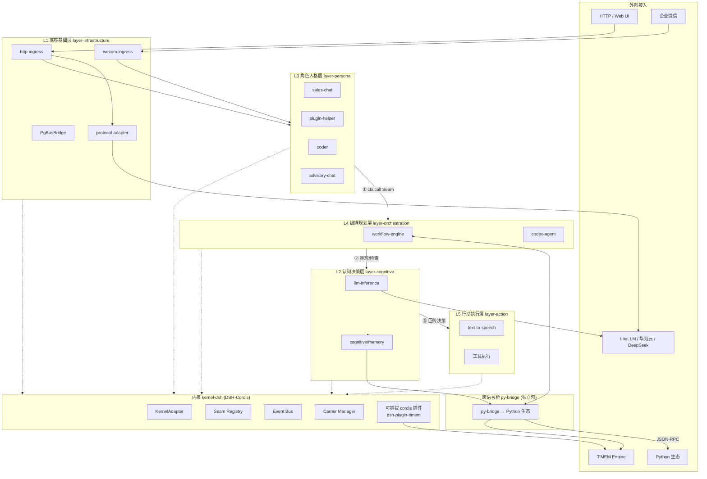

# aigility-harness

> **五层可插拔智能 Agent 全域架构** —— 一套可承载任何 LLM / 工具 / Agent / 内核的「Harness」工程范式。
>
> *A five-layer, fully-pluggable AI Agent harness: kernel-agnostic, contract-driven, hot-swappable.*

### 仓库镜像

| 平台 | 地址 |
|------|------|
| **GitHub**（全球主镜像） | https://github.com/AIGility-Cloud-Innovation/aigility-harness |
| **Gitea**（国内主镜像） | https://git.aigility.cloud/TiMEM-AI/aigility-harness |

双仓库同步维护，提交以 Gitea 为权威信源，GitHub fast-forward 同步。

### 总体架构

```text
┌─────────────────────────────────────────────────────────────────────────┐
│                        aigility-harness 五层架构                          │
│                 「契约是主体，插件是过客」— 一切可插拔                     │
├─────────────────────────────────────────────────────────────────────────┤
│                                                                         │
│   外部信号:  HTTP / 企业微信 / IM / Web UI                                │
│        │  (L1 http-ingress / wecom-ingress 收口)                        │
│        ▼                                                                 │
│   ┌─────────────────────────────────────────────────────────────────┐   │
│   │  L3 角色人格层 (layer-persona)     角色 = 入口 + 人格             │   │
│   │      sales-chat  plugin-helper  coder  advisory-chat             │   │
│   │      (定义性格/输入方式/表达方式, 统一 PersonaInput)               │   │
│   └────────────────────────────┬────────────────────────────────────┘   │
│                                │ ① ctx.call (Seam 契约)                 │
│                                ▼                                         │
│   ┌─────────────────────────────────────────────────────────────────┐   │
│   │  L4 编排规划层 (layer-orchestration)   任务规划 / 工作流          │   │
│   │      @orchestration/workflow-engine  codex-agent                 │   │
│   └────────────────────────────┬────────────────────────────────────┘   │
│                                │ ② 推理/检索                             │
│                                ▼                                         │
│   ┌─────────────────────────────────────────────────────────────────┐   │
│   │  L2 认知决策层 (layer-cognitive)    大脑                          │   │
│   │      @cognitive/llm-inference  @cognitive/memory                 │   │
│   └────────────────────────────┬────────────────────────────────────┘   │
│                                │ ③ 决策结果回传                         │
│                                ▼                                         │
│   ┌─────────────────────────────────────────────────────────────────┐   │
│   │  L5 行动执行层 (layer-action)     手脚                            │   │
│   │      @action/text-to-speech  工具执行 / 多渠道输出                │   │
│   └─────────────────────────────────────────────────────────────────┘   │
│                                                                         │
│   ┌─────────────────────────────────────────────────────────────────┐   │
│   │  L1 底座基础层 (layer-infrastructure)   系统地基                  │   │
│   │      config / logging / protocol-adapter / PgBusBridge           │   │
│   └─────────────────────────────────────────────────────────────────┘   │
│   ┌─────────────────────────────────────────────────────────────────┐   │
│   │  跨语言桥 py-bridge (独立包, 只依赖 core)                         │   │
│   │      声明式接入 Python 生态 (aigility 等) — 能力可声明到任意层     │   │
│   └─────────────────────────────────────────────────────────────────┘   │
│   ┌─────────────────────────────────────────────────────────────────┐   │
│   │  内核 kernel-dsh (DSH-Cordis)                                     │   │
│   │      KernelAdapter / Seam Registry / Event Bus / Carrier         │   │
│   │      cordis 插件可插拔: dsh-plugin-timem → TiMEM 记忆/规则        │   │
│   └─────────────────────────────────────────────────────────────────┘   │
│                                                                         │
└─────────────────────────────────────────────────────────────────────────┘

外部接入:
  LLM (LiteLLM/华为云/DeepSeek) ←→ L2   ·   TiMEM Engine ←→ timem 插件 / @cognitive/timem-memory
  HTTP / 企业微信 / IM ←→ L1 入口       ·   Python 生态 ←→ py-bridge（独立包）
  调用顺序: 外部信号 → L3(角色) → L4(编排) → L2(认知) 回传 → L5(行动)
  依赖方向: L5→L4→L3→L2→L1（只依赖比自己小的层号；py-bridge 只依赖 core）
```

### 详细架构（Mermaid）




---

## 一、定位：这是一套 Harness，不是某个 Agent

`aigility-harness` 是一套**可以插上任何东西**的智能体运行底座。现在框架上挂着的 Codex、LiteLLM、deepseek-v4-pro 等**都只是验证案例**——它们可以被同契约的任意实现一键替换，框架本身不依赖其中任何一个。

一句话总结本架构：

> **契约是主体，插件是过客。接口永久不变，实现任意替换。**

核心能力矩阵（四大组合创新 —— 业界没有开源框架完整提供）：

| # | 创新点 | 说明 |
|---|--------|------|
| 1 | **五层业务域严格分层** | 底座 / 认知 / 人格 / 编排 / 行动，固定分层、单向依赖、永不交叉 |
| 2 | **四种运行载体统一抽象** | 子线程 / 附属子进程 / 本机守护进程 / 独立端口网络服务，可逐层动态切换 |
| 3 | **原型 ↔ 生产双形态** | 同一套代码，原型单体 ↔ 生产分布式，上层业务零改动 |
| 4 | **Seam 契约自动热替换** | 基于 Capability Seam 能力接缝，健康探测 + 负载/显存/故障指标驱动运行时无感切换 |

---

## 二、创意思路（白皮书核心）

### 2.1 设计目标

构建一套**完全解耦、分层自治、契约驱动、运行时可自动替换**的新一代 AI Agent 系统：

1. 业务能力按五层领域严格分层，层与层零耦合。
2. 每层能力不绑定具体实现，统一基于 **Capability Seam 能力接缝**做 Consumer / Provider 契约解耦。
3. 所有模块支持四种运行载体动态切换：子线程、附属子进程、本机守护进程、独立端口网络服务。
4. 支持原型环境 ↔ 生产环境无缝切换，上层业务代码零改动。
5. 支持智能自动热替换：基于负载、显存、故障、资源占用自动切换底层实现。
6. 继承 DSH-Cordis 原生能力：插件生命周期、依赖注入、副作用可逆、事件溯源、上下文隔离。

### 2.2 为什么叫 Harness

业界标准 **Agent Harness 四层**（Model / Harness 调度循环 / Tools / Environment）与本架构的映射关系：

| 标准 Harness 层 | 本架构对应 |
|-----------------|-----------|
| Model 模型层 | 认知决策层（大脑） |
| Harness 调度循环层 | 编排规划层（小脑） |
| Tools 工具执行层 | 行动执行工具层（手脚） |
| Environment 运行环境层 | 角色人格层（Persona）+ 底座基础层（地基） |

**结论：本五层架构是标准 Harness 范式的工程落地增强版** —— 任务调度循环（Harness）本就是编排规划层的职责，而本架构把 Model / Tools / Environment 全部升级为可插拔契约。

### 2.3 工程范式的独特性

分层思想、Seam 契约解耦、进程隔离都各有业界参考，本架构的**独一无二的组合点**是：

1. **五层业务域 + 四种进程载体 + 原型/生产双形态 + 自动热替换** 完整闭环落地。
2. 业界没有任何开源框架提供：**分层智能自动降级、跨载体统一抽象、进程内 / 跨进程 / 分布式统一契约**。
3. DSH 只提供进程内插件模型，本架构补齐**分布式、多进程、智能调度、自动切换**全部缺失环节。

---

## 三、五层标准化业务域

所有 AI 能力严格划分为五层，**固定分层、永不交叉、单向依赖**：

| 层 | 名称 | 定位 | 典型模块 | 载体策略（原型 → 生产） |
|----|------|------|---------|--------------------------|
| L1 | **底座兼容基础层**（地基） | 通信、契约、安全、观测基础设施 | 全局消息总线、统一消息契约、MCP/A2A 协议桥接、鉴权/限流/熔断、全链路追踪、自动切换控制器 | 全部独立网络服务，不属于 DSH 进程 |
| L2 | **认知决策核心层**（大脑） | 智能体自我、推理、决策、身份中枢 | LLM 模型适配器、多模型算力路由、人格系统、记忆引擎、会话/身份上下文 | DSH 进程内插件 → 算力路由 + 记忆抽离为独立网络服务 |
| L3 | **角色人格层**（Persona） | 特性打包为可交互角色：性格 + 信息接收/表达方式 | 具名角色：销售客服（sales-chat）、插件安装助手（plugin-helper）、编码助手（coder）、就业顾问（advisory-chat）、框架介绍员（harness-guide）、TiMEM 客服（timem-support）；输入/输出形态（文本/语音，ASR/TTS）、按角色定制 | 附属子进程 → 本机独立守护进程 → 网络服务集群 |
| L4 | **编排规划层**（小脑） | 任务调度、思考循环、多智能体协作 | Agent 主思考循环（ReAct/PlanExecute）、任务规划/复盘、SubAgent 调度、定时/长任务 | DSH 插件线程 → 复杂子 Agent 拆独立 Worker 进程/服务 |
| L5 | **行动执行工具层**（手脚） | 产生真实外部副作用 | 代码沙箱、文档/文件操作、系统资源管控、IoT/机器人控制 | 附属子进程 → 独立守护进程/远程隔离服务 |

### 各层运行特征

- **L1 底座层**：全局唯一、所有模块依赖、完全与业务解耦。
- **L2 认知层**：Always-On 核心常驻，强状态、强一致性、不可随意重启。
- **L3 角色层**：延迟敏感、硬件绑定、与用户直接交互，纯信号转换与角色形象，无核心决策。
- **L4 编排层**：流程驱动、状态机复杂、多分支多迭代，不直接操作硬件。
- **L5 执行层**：高风险、高权限、崩溃影响外部环境，必须强隔离、强沙箱、强故障域。

---

## 四、四种运行载体统一抽象

所有能力模块仅存在四种部署形态，**所有层级均可动态切换**：

| 载体 | 描述 | 优点 | 缺点 | 适用 |
|------|------|------|------|------|
| **Thread** 子线程 | 同进程插件 | 最快、零通信损耗 | 插件崩溃会宕掉主进程 | 纯逻辑、无不稳定依赖、无硬件调用（认知层轻量逻辑、编排层逻辑） |
| **Subprocess** 附属子进程 | 父进程托管，生命周期跟随主进程 | 崩溃隔离、启动销毁灵活 | 有 IPC 开销 | 短时任务、原型工具、临时执行 |
| **Daemon** 本机守护进程 | 完全独立生命周期，主进程崩溃不影响 | 独占硬件资源（声卡/显卡/串口） | 状态同步需桥接 | 生产音视频、硬件、机器人强制使用 |
| **NetworkService** 独立端口网络服务 | 跨机器、可集群、可扩容 | 分布式、多实例共享 | 网络依赖 | 算力、记忆、网关、RAG、IM |

---

## 五、DSH-Cordis 内核：底层运行支撑

本架构 = **业务五层 + DSH 内核四层** 完美叠加：

| 内核层 | 职责 |
|--------|------|
| **Plugin Layer** 插件层 | 所有业务能力的代码载体 |
| **Capability Seam Layer** 能力接缝层（架构灵魂） | `ServiceDefinition` 统一接口契约 / `Provider` 能力实现方 / `Consumer` 能力调用方；接口永久不变，实现任意替换 |
| **Runtime Core Layer** 运行时内核 | 全局上下文 `ctx`、插件 DI、生命周期管理、副作用可逆回退、会话/日志/事件溯源 |
| **Transport Layer** 传输层 | DSH 原生仅进程内事件总线；无网络、无跨进程 |

**关键叠加关系**：业务五层是**业务领域分层**，DSH 四层是**运行时技术栈分层**；所有业务能力全部通过 Seam 注册，从而实现可替换。

### DSH 已具备（无需自研）vs 本架构补齐

**DSH 自带**：插件生命周期/热插拔、Capability Seam 契约解耦、副作用自动回退、依赖注入自动加载、Profile 环境区分、事件溯源/会话日志、进程内高可靠事件总线。

**本架构必须自研补齐**（DSH 完全不具备）：

1. **跨进程/跨机器通信桥接层**（最大核心缺口）—— Seam ↔ NATS 双向协议转换插件、多语言异构服务适配
2. **四种进程载体统一抽象管理层** —— 守护进程托管、保活、重启、状态上报、生命周期统一调度
3. **智能自动热替换调度系统** —— 全 Provider 健康探测、负载/显存/故障指标采集、自动解绑/绑定、运行时无感切换
4. **跨进程副作用回收机制** —— 原生 `ctx.effect` 仅管进程内，需扩展远端资源释放、硬件复位、连接销毁
5. **全链路分布式追踪** —— 跨进程 traceId 透传、全局统一观测
6. **状态迁移系统** —— 记忆、会话、人格跨实现迁移
7. **完整生产底座** —— 鉴权、安全、限流、熔断、协议桥接

> **核心结论：DSH 是完美的「进程内智能体内核」，本架构补齐所有「分布式、多进程、智能运维、生产级能力」。**

---

## 六、原型模式 ↔ 生产模式（双形态）

| | 原型模式（极速开发） | 生产模式（企业级高可用） |
|---|----------------------|--------------------------|
| 认知层 | DSH 进程内插件、内存级 Provider | 重负载能力抽离网络服务 |
| 人格层 | 附属子进程 | 全部改本机守护进程 |
| 编排层 | DSH 插件线程 | 复杂工作流拆 Worker 集群 |
| 执行层 | 附属子进程 | 硬件/沙箱独立进程强隔离 |
| 底座层 | 进程内事件总线 | 全局 NATS 总线统一通信 |

**核心优势：同一套代码、两套运行形态、零业务改动。**

---

## 七、快速开始

### 环境要求

- **Node.js ≥ 20**
- **pnpm ≥ 9**

### 安装

```bash
pnpm install
```

> 工作区启用 `allowBuilds` 白名单：esbuild 允许构建；msedge-tts / protobufjs / sharp / onnxruntime-node / ffi-napi / ref-napi 默认关闭挨，按需开启（启用 whisper 改 `onnxruntime-node: true`，启用 vosk 改 `ffi-napi: true`）。

### 构建 / 类型检查 / 测试

```bash
pnpm run build        # 全部包构建
pnpm run typecheck    # tsc --noEmit 全量类型检查
pnpm run test         # vitest 全量测试（9 包 120+ 例，含 kernel-dsh 42 例）
```

### 运行原型演示

```bash
pnpm example:prototype
```

原型模式：五层能力全部以 DSH 进程内插件运行，内存级 Provider，无需任何外部服务。演示流程：人格（文本输入）→ 认知（litellm/内存推理）→ 编排（任务规划 + codex-agent）→ 行动（TTS）→ 底座（配置/日志/协议适配）。

### 开箱即用（最小 Web UI）

```bash
pnpm --filter prototype-mode start   # 或组合示例:
pnpm --filter @aigility-harness/example-openai-gateway start
```

起服务后浏览器打开 `http://localhost:<port>/`（或 `/ui`），即可与三个角色对话：

| 页签 | 端点 | 功能 |
|------|------|------|
| **销售客服** | `POST /api/chat` | 业务对话（销售客服角色 → 工作流回复） |
| **插件安装助手** | `POST /api/plugin-helper` | 开箱引导安装：问"怎么加插件/RAG/记忆" → 真实扫描插件清单 → 返回接入指引 |
| **编码助手** | `POST /api/coder` | 编码对话（coder 角色 → codex-agent → Codex 真实干活） |

agent 路径→角色映射可配置（`agentRoutes`），未命中路径回退 `perceptionId`。

### 特色案例：企业微信 → Codex

企业微信「智能机器人」原生接入——在企微群里 @机器人，即可驱动 codex 真实干活：

```bash
# 1. 企微后台创建「智能机器人」拿到 botId+secret
export WECOM_BOT_ID=xxx WECOM_BOT_SECRET=xxx
# 2. 启动特色案例装配
pnpm --filter wecom-coder start
# 3. 企微 @机器人: 「帮我写个冒泡排序」 → codex 干活 → 群里回结果
```

链路：企微 WebSocket 长连接（`@wecom/aibot-node-sdk`）→ `@infrastructure/wecom-ingress` → `@persona/coder` → `@orchestration/codex-agent` → Codex（经框架认知层供能）。支持流式"思考中…"占位与 Markdown 回复。

### 现有验证案例（均为可替换示例）

| 能力 | 当前实现 | 可替换为 |
|------|---------|---------|
| LLM 推理 | `litellmProvider`（真实调用 LiteLLM，deepseek-v4-pro） | 任意 OpenAI 兼容网关（vLLM/Ollama/本地 stub） |
| 编码 Agent | `codex-agent`（codex CLI → localhost:4000） | 任意符合契约的 Agent Provider |
| 协议适配 | `protocol-adapter`（api-router 协议翻译） | 任意协议桥接实现 |
| HTTP 入口 + 流式 | `http-ingress` + `sse.ts`（`/v1/chat/completions` 支持 `stream:true` → SSE 帧流） | 任意传输实现（Hono 备件换装时 import 同款 sse helper） |
| **角色对话** | `sales-chat`（销售客服角色, 由 chat-agent 正名而来） | 任意 L3 角色（特性打包为 persona 插件） |
| **开箱引导安装** | `plugin-helper` 角色 → `plugin-install` 工作流（扫描 py-plugins.json + packages → 契约匹配 → 接入指引） | 任意安装/引导工作流 |
| **最小 Web UI** | http-ingress `GET /` / `/ui`（单文件 HTML, 双角色页签, 零依赖） | 任意前端 |
| **企业微信入口（特色案例）** | `wecom-ingress`（aibot-node-sdk WebSocket 长连接 → 角色路由 → replyStream）+ 三个开箱案例：`wecom-coder`（@机器人 → coder → codex）/ `wecom-guide`（框架介绍员）/ `wecom-timem`（TiMEM 客服） | 任意 IM 通道（钉钉/飞书/微信，同构接入） |
| **框架介绍员** | `harness-guide` 角色 → `@orchestration/workflow-engine-timem`（YAML 工作流经 py-bridge 驱动 aigility LangGraph） | 任意引导/编排流程 |
| **TiMEM 记忆客服** | `timem-support` 角色（TiMEM 记忆作对话上下文）+ BM25 检索增强（`aigility.retrieval.bm25` 经 py-bridge） | 任意记忆/检索服务 |
| TTS | `text-to-speech` | 任意 TTS 引擎 |
| **Python 能力桥接** | `py-bridge`（JSON-RPC over stdio → aigility ADK） | 任意 Python 包，声明式配置接入 |
| **工作流编排** | `aigility.workflow.WorkflowEngine`（YAML → LangGraph） | 任意编排引擎，通过 Seam 契约替换 |
| **RAG 检索** | `aigility.rag.RAGService`（通过 py-bridge） | 任意 RAG 实现 |
| **长期记忆** | `aigility.memory.Memory`（通过 py-bridge） | 任意记忆服务 |

---

## 八、py-bridge：跨语言插件桥接

> **包定位**：`@aigility-harness/py-bridge` 是独立包（不在 layer-infrastructure 内），只依赖 core。
> 职责边界：**DSH/cordis 侧插件**（如 dsh-plugin-timem）由内核插件树承载；**aigility 系等 Python 插件**
> 由 py-bridge 承载 —— `py_bridge_worker.py` 是纯 Python 进程（JSON-RPC over stdio），不依赖 TS 运行时，
> TS 侧只负责 spawn 与字段映射。能力 ID 由配置声明（`layer` 字段），可挂到任意层（如 @orchestration/workflow-engine）。

### 8.1 已兼容的插件类别

harness 通过 py-bridge 支持三类插件，覆盖从底层能力到编排工具的全栈：

| 插件类别 | 接入方式 | 语言 | 示例 | 状态 |
|---------|---------|------|------|------|
| **TS 原生插件** | LayerPlugin 直接注册 | TypeScript | litellmProvider, codex-agent, TTS, protocol-adapter | ✅ 阶段 1 |
| **Python 能力插件** | py-bridge 声明式配置 (py-plugins.json) | Python | aigility.rag, aigility.memory | ✅ 阶段 1.5 |
| **Python 编排工具插件** | py-bridge + YAML 配置 | Python | aigility.workflow.WorkflowEngine | ✅ 阶段 1.5 |

### 8.2 py-bridge 设计

```
harness (TS)                          Python (子进程)
  │                                     │
  ├── py-plugins.json (声明式配置)      │
  │   "function": "aigility.rag.RAGService"  │
  │   "method": "search"               │
  │                                     │
  ├── PyWorker (TS)                    py_bridge_worker.py
  │   spawn python subprocess ←──────→ JSON-RPC over stdio
  │   请求队列 + Promise 映射           动态 import + 实例缓存
  │   callBatch() 批量调用              ThreadPoolExecutor (同步函数)
  │                                     │
  └── Seam Provider (自动生成)         │
      ctx.call("@cognitive/rag", req) → │
```

**核心特性：**
- **零端口** — JSON-RPC over stdin/stdout，父进程托管生命周期
- **Python 侧零改动** — 只写 JSON 配置，不改 Python 仓库
- **单进程多实例** — 一个 worker 服务多个 capability
- **实例缓存** — initialize 一次，后续 call 零 import 开销
- **批量调用** — callBatch() 一次往返多个调用
- **Seam 契约 1:1 映射** — 未来切换 Python 框架时 Python 代码零改动

### 8.3 已验证的 aigility 能力

| Seam 能力 ID | 层 | aigility 模块 | 方法 | 端到端测试 |
|-------------|-----|-------------|------|-----------|
| `@orchestration/workflow-engine` | L4 | `aigility.workflow.WorkflowEngine` | `invoke` | ✅ YAML → LangGraph → 条件分支 |
| `@cognitive/memory` | L2 | `aigility.memory.Memory` | `search` | ✅ 异步方法正确处理 |
| `@cognitive/rag-retrieval` | L2 | `aigility.rag.RAGService` | `search` | ⚠️ 需 dashscope 包 |
| `@orchestration/chat-flow` | L4 | `aigility.chatflow.ChatFlow` | `invoke` | ✅ 初始化成功 |
| `@orchestration/workflow-engine-timem` | L4 | `aigility.workflow.WorkflowEngine` | `ainvoke` | ✅ 企微客服工作流（timem_support） |

### 8.4 编排工具 + 编排实例分离

```
编排工具 (插件)     = aigility.workflow.WorkflowEngine (LangGraph 引擎)
编排实例 (配置)     = workflow_config.yaml (声明节点和边)
底层能力 (插件)     = RAG / Memory / FAQ / LLM (被编排工具调用)
```

编排工具不知道业务逻辑，业务逻辑不知道 RAG/Memory 的实现。编排实例 (YAML) 把两者接线。
编排实例中可混用三种节点：`function_node` (本地函数)、`llm_node` (LLM 推理)、`capability_node` (Seam 能力调用)。

---

## 九、统一数据底座：PostgreSQL 单库多职

**架构决策（2026-08-26）**：所有项目的数据库统一用 **PostgreSQL 单库多职**——业务表 + 消息总线 + 任务队列 + 向量检索，替代 Redis / RabbitMQ / Qdrant / Chroma / MySQL 分散中间件。一个库 = 一套备份/监控/高可用，且跨四职的事务可原子提交。

| 职责 | PG 实现 | 契约（core） | 状态 |
|------|---------|-------------|------|
| **业务持久化** | 普通表 | — | ✅ 既有 |
| **消息总线** | `LISTEN/NOTIFY` + `event_log` 表（小信封避开 8KB 限制，seq 自增支持事件溯源） | `BusBridge` / `BusEnvelope` | ✅ `PgBusBridge` 已实现 |
| **任务队列** | pgmq 扩展 或 `FOR UPDATE SKIP LOCKED` | `TaskQueue`（enqueue/dequeue/ack/nack/stats，租约式消费语义对齐 SQS/pgmq） | 🔶 契约就绪，实现后置 |
| **向量检索** | pgvector（HNSW 索引） | `VectorStore`（upsert/search/remove/count，支持 metadata 过滤） | 🔶 契约就绪，实现后置 |

**可更换原则**：三个契约（BusBridge / TaskQueue / VectorStore）全部"契约在 core、实现在层"——将来任何一职要换独立中间件（NATS / Redis Stream / Milvus），只动工厂一行，上层业务零改动。

---

## 十、落地实施路线

| 阶段 | 目标 | 内容 |
|------|------|------|
| **阶段 1**（✅ 已完成） | 原型闭环 | 五层能力 DSH 插件化，验证完整业务逻辑；kernel-dsh 35 测例 + codex-agent 规划闭环通过 |
| **阶段 1.5**（✅ 已完成） | 跨语言桥接 | py-bridge 通用 Python 对接器，aigility ADK 端到端验证通过 |
| **阶段 1.75**（✅ 已完成） | 开箱可用 | sales-chat/plugin-helper 角色 + plugin-install 引导工作流 + 最小 Web UI（`GET /` `/ui`）+ agent 路径→角色路由 |
| **阶段 2**（🔶 桥与契约就绪） | 桥接层开发 | BusBridge 契约 + BusEnvelope 信封 + RemoteEventBus 跨进程事件桥 + `PgBusBridge` 实现（LISTEN/NOTIFY + event_log，✅）；`TaskQueue` / `VectorStore` 契约就绪（🔶 实现后置）；真实总线可更换（pgmq/pgvector/NATS/Milvus 按部署选定） |
| **阶段 3**（⏳ 未实现） | 进程载体封装 | 守护进程管理、多载体统一抽象 |
| **阶段 4**（⏳ 未实现） | 智能调度与自动替换 | 健康探测、指标采集、自动切换控制器 |
| **阶段 5**（⏳ 未实现） | 生产加固 | 安全、鉴权、全链路追踪、状态迁移、熔断降级 |

---

## 十一、目录结构

```
aigility-harness/
├── packages/
│   ├── core/                      # 核心契约：LayerId / CarrierKind / ServiceDefinition / Seam
│   │                              #   Provider / Consumer / LayerPlugin / KernelAdapter
│   │                              #   LlmInference 契约（llm-contract.ts）/ BusBridge / TaskQueue / VectorStore
│   ├── kernel-dsh/                # DSH-Cordis 内核适配器（Seam Registry / Effect Manager / Carrier Manager）
│   ├── layer-cognitive/           # L2 认知决策层（LLM 推理：stub + litellm + timem-memory-provider）
│   ├── layer-persona/            # L3 角色人格层（sales-chat / plugin-helper / coder / advisory-chat / harness-guide / timem-support / speech-to-text）
│   ├── layer-orchestration/       # L4 编排规划层（任务规划 + plugin-install + codex-agent）
│   ├── layer-action/              # L5 行动执行层（TTS）
│   ├── layer-infrastructure/      # L1 底座基础层（config/logging/protocol-adapter/http-ingress/wecom-ingress/PgBusBridge）
│   │   └── src/
│   │       ├── protocol-adapter.ts    # 协议翻译（Anthropic/OpenAI/Responses → 内部标准，类型取自 core 契约）
│   │       ├── http-ingress.ts        # HTTP 唯一入口（dev/agent 双链路 + SSE 流式 + 最小 UI）
│   │       ├── sse.ts                 # SSE 帧编码原子模块（传输无关）
│   │       └── ui.ts                  # 最小 Web UI（单文件内嵌 HTML, GET / /ui）
│   ├── py-bridge/                 # 跨语言桥接（独立包，只依赖 core）：Python 生态声明式接入
│   │   ├── src/
│   │   │   ├── types.ts           # 声明式配置 + 通信协议类型
│   │   │   ├── py-worker.ts       # 子进程管理 + 请求队列 + 批量调用
│   │   │   ├── py-bridge.ts       # Provider 工厂：配置 → Seam Provider（能力可声明到任意层）
│   │   │   ├── config-loader.ts   # 配置加载 + 环境变量替换
│   │   │   └── py-bridge.test.ts  # 端到端测试（7 例，真实 spawn Python worker）
│   │   └── scripts/
│   │       └── py_bridge_worker.py  # 通用 Python worker（纯 Python 运行，不依赖 TS）
│   └── prototype-mode/            # 原型演示入口（InMemoryKernel → 五层插件装配）
├── examples/                      # 可替换示例装配（各自独立 pnpm 包）
│   ├── dsh-timem-demo/            # DSH 内核 TiMEM 插件演示
│   ├── openai-gateway-composition/ # OpenAI 兼容网关组合示例
│   ├── http-gateway-alternative/  # 备件式 HTTP 网关（换装演示）
│   ├── wecom-coder/               # 企微 @机器人 → coder → codex
│   ├── wecom-guide/               # 企微 → harness-guide 框架介绍员
│   └── wecom-timem/               # 企微 → timem-support TiMEM 客服
├── config/
│   └── py-plugins.json            # Python 插件声明式配置（aigility 能力映射）
├── tests/
│   ├── e2e-aigility.py            # aigility Memory/RAG 端到端测试
│   └── e2e-workflow.py            # aigility WorkflowEngine 端到端测试
└── docs/
    └── plugin-integration-design.md   # 五层插件接入设计文档 v0.2
```

---

## 十二、终极架构总结

1. **五层业务域**：底座、认知、人格、编排、行动 —— 单向依赖，永不交叉
2. **四层运行内核**：DSH-Cordis 原生支撑（插件 / Seam / 运行时 / 传输）
3. **四种运行载体**：线程 / 子进程 / 守护进程 / 网络服务 —— 逐层可切换
4. **核心机制**：Capability Seam 契约热替换 —— 接口不变，实现任意替换
5. **形态双模式**：原型单体 / 生产分布式 —— 同一套代码零改动切换
6. **最大亮点**：智能自动动态换层、换实现、换载体

> 现阶段以 DSH 兼容适配为首要目标；未来若出现与 DSH 相似的产品，可通过统一 `KernelAdapter` 契约**一键替换迁移**到其他内核，业务层代码零改动。

---

License: MIT · 技术栈：TypeScript 5.5 + pnpm workspace + vitest · Node ≥ 20

## 十三、dsh-plugin-timem 演示（TiMEM 记忆/规则接入）

[`examples/dsh-timem-demo`](examples/dsh-timem-demo) 演示 TiMEM 能力插件插入 DeepSeek Harness 运行时：

```bash
# 方式 1: mock 模式 (无 TIMEM key 也跑通)
cd examples/dsh-timem-demo
TIMEM_DEMO_MOCK=1 pnpm start

# 方式 2: 真实 TiMEM Engine
TIMEM_API_KEY=xxx TIMEM_BASE_URL=http://127.0.0.1:8001 pnpm start
```

```ts
import { Context } from "@deepseek-ai/cordis";
import { timemPlugin } from "@timem/dsh-plugin-timem";

const root = new Context();                       // DSH runtime
await root.plugin(timemPlugin, { apiKey, baseUrl });  // 插件插入
await root.timem.search({ user_id: 123, query: "偏好" });   // 记忆
await root.timem.recallRules({ scene: "简历评估" });        // 规则
```

插件本体: [`dsh-plugin-timem`](https://git.aigility.cloud/TiMEM-AI/dsh-plugin-timem)
（cordis 插件库, 协议对齐 timem-sdk-python: X-API-Key + /api/v1/*)

---
