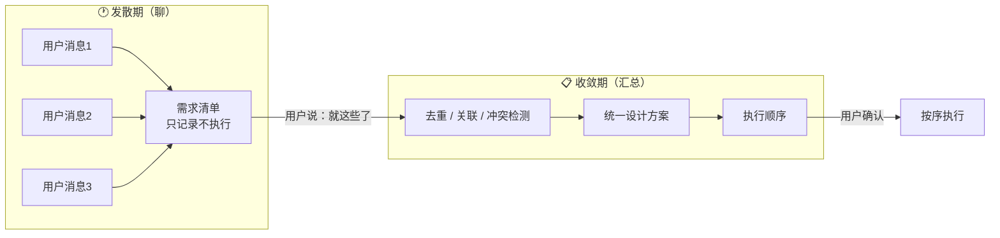
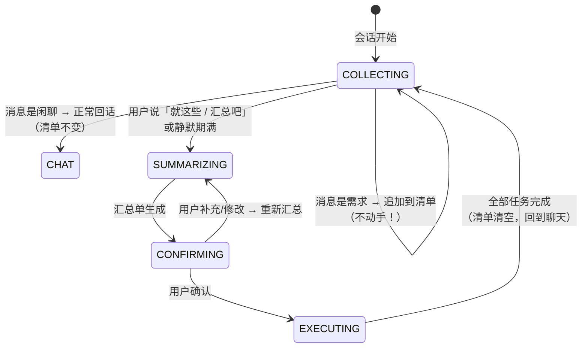
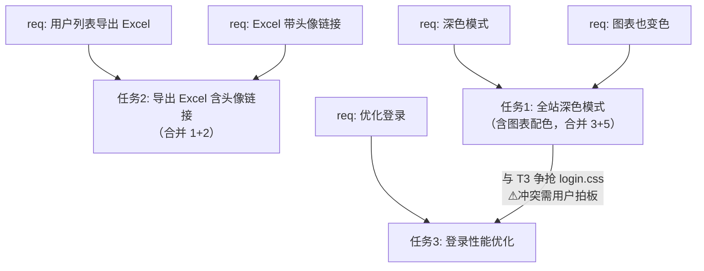
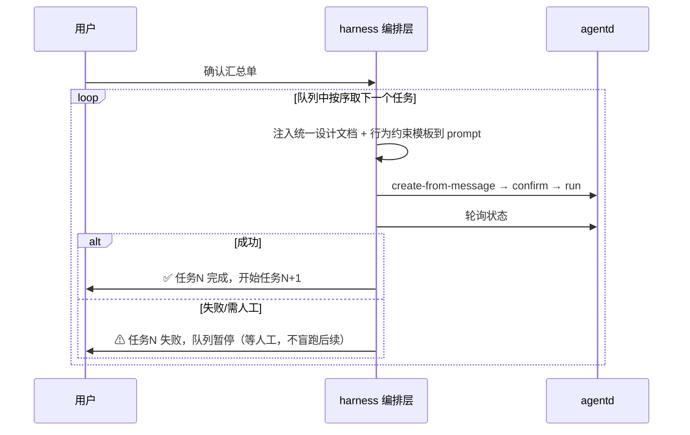

# 编排层工作流设计：任务判定 → 归仓 → 派发执行

> 状态：**设计稿，待评审**
> 位置：`aigility-harness/packages/layer-orchestration`
> 目标：让「入口消息 → 任务执行」走正确的三段式工作流，替代现在的
>       「任何消息直接建任务 + 固定 standalone」

---

## 1. 背景与问题

当前链路（已工作但有缺陷）：

```
飞书消息 → ingress → 人格 → @orchestration/timem-project-task
   → POST /v1/tasks（固定 confirm standalone）→ agentd run → git fetch 崩
```

缺陷：
1. **没有任务判定**：「你好」「在吗」也会建任务 → agentd 空转执行
2. **没有归仓**：全部固定 standalone，不识别「在 gyzy_platform 修 bug」
3. 执行引擎默认项目是 git 仓库（fetch origin/dev），standalone 空 repo 直接秒失败

**正确形态**（用户拍板）：编排层工作流先判定「是不是任务」→「归哪个仓库」→ 再派发执行。

## 2. 实现载体选择

harness 编排层现有两种形态，**本设计选「TimemTaskProvider 内部状态机」**：

| 载体 | 评估 | 结论 |
|---|---|---|
| workflow-engine stub 扩充 | stub 是确定性占位，P... | ✗ 架构方向是 py-bridge 换 LangGraph，不适合塞 TS 业务 |
| **timemTaskProvider 内做三段式** | 它就是真实执行桥接，三段式天然属于它的职责 | ✅ |
| 新开 @orchestration/task-orchestrator | 多一个 hop，装配示例要改 | ✗ 过度设计 |

## 3. 工作流状态机

```
execute(TimemTaskRequest)
  │
  ├─ ① classify（编排层内，不调 agentd）
  │    规则快速判定：
  │    - 非任务关键词（你好/谢谢/在吗/辛苦了/好的/收到）→ CHAT
  │    - 任务意图词（执行/修复/改/建/开发/跑/测试/更新/排查/部署/在X项目…）→ TASK
  │    - 两者都不含 → 调 @cognitive/llm-inference 让模型分类（prompt: 是否是任务+项目名）
  │    → 返回 CHAT | TASK | UNCLEAR
  │
  ├─ ①a  CHAT → return ok({type:"chat", text: 闲聊回复策略})
  │        策略1：调用 llm-inference 生成闲聊回复（需 llm 可用）
  │        策略2：固定回复「我在的，有什么任务需要我执行吗？」（零依赖兜底）
  │
  ├─ ①b  UNCLEAR → return ok({type:"ask", text:"你希望我做什么呢？可以描述为一个任务…"})
  │
  ├─ ② identify（归仓）
  │    projectId 已显式传入（request.project_id）→ 用之
  │    否则：
  │      - 消息含项目名 → 提取候选（LLM 或规则：/在([\w-]+)项目/）
  │      - 调 agentd POST /v1/tasks/identify-project（resolveProject 四连）
  │      - 返回 projectId | 空
  │    → 空 → return ok({type:"ask", text:"这个任务要归到哪个仓库？…"})
  │
  ├─ ③ dispatch（派发执行）
  │    create-from-message（带 projectId）→ confirm（如 pending）→ run → 轮询
  │    → return ok({type:"task", task_id, status, response})
  │
  └─ 异常处理：
       agentd 不可达 → ok({type:"error", text:"执行引擎未就绪…"})
       UDS 错误 → 降级提示（不 panic）
```

## 4. 接口形状（TimemTaskRequest/Response 扩展）

```ts
// Request 新增
project_id?: string;        // 显式归仓
conversation_id?: string;   // 会话（绑定时用）
chat_type?: string;         // p2p | group
resources?: ResourceRef[];  // 图片等

// Response 改为判别联合
type TimemTaskResponse =
  | { type: "chat";     text: string }                        // ①a 闲聊
  | { type: "ask";      text: string }                        // ①b/② 反问
  | { type: "task";     task_id: string; status: string;
      response: string }                                      // ③ 任务结果
  | { type: "error";    text: string };                       // 异常
```

## 5. 判定规则集（① classify）

**规则层（先跑，零成本）**：
```ts
const CHAT_ONLY = /^(你好|hi|hello|在吗|谢谢|辛苦|好的|收到|嗯|哦|在|哈喽)$/i;
const TASK_VERBS = /(执行|修复|修改|改|创建|新建|开发|实现|跑|运行|测试|部署|排查|更新|删|清理|检查|验证|告诉|生成|写|分析|重构|迁移)/;
const PROJECT_PATTERN = /在\s*([\w\-\.\/]+?)\s*(项目|仓库|repo)/;
```

**LLM 层（规则判不了时）**：调 `@cognitive/llm-inference`
```
prompt: 判断下面用户消息是否是「要 AI 执行的任务」。
        如果是，提取其针对的项目/仓库名（如有）。
        输出 JSON {is_task: bool, project: string|null, reason: string}
```

## 6. 归仓顺序（② identify，与 agentd resolveProject 一致）

1. `request.project_id` 显式传入 → 用
2. 会话绑定（conversation_bindings 表，agentd 侧查）→ `identify-project` 返回
3. 消息含项目名 → LLM/规则提取 → `identify-project` 复核
4. 都没有 → 反问用户

**5. git 有效性校验（归仓后、派发前，关键新规则）**：
   确认项目后，agentd 在 identify-project（或 create-from-message 确认前）校验
   目标项目的 root_path 是否为有效 git 仓库（`git rev-parse --is-inside-work-tree`）：
   - 有效 → 继续派发
   - 缺 git（空仓库/无 .git/无 origin 远程）→ 返回**类型化错误**：
     ```json
     { "type": "error",
       "text": "项目「{name}」不是有效的 git 仓库（{原因}），无法执行任务。
               请先将该目录初始化为 git 仓库并配置远程。" }
     ```
   - **绝不带着坏 git 去派发执行**——执行引擎只在归仓+git 双校验通过后才碰 git

## 7. 装配与依赖

- **插件**：timem-project-task 逻辑不变（仍独立文件），其 execute 内部按状态机走
- **新依赖**：`llm-inference`（@cognitive/llm-inference，编排层 manifest 的 consumes 已声明）
- **agentd 新增**：`POST /v1/tasks/identify-project`（薄封装 resolveProject，输入 text/conversation_id/sender_id 输出 projectId/confidence/method）
- **示例装配**：feishu-timem 示例已在调用 timem-project-task，无需改路由；persona 改为透传原样（不再组织载荷，只加 user_id/session_id）

## 8. 验收标准

1. 飞书发「你好」→ 回闲聊回复，**任务表无新增**
2. 飞书发「在 Standalone 项目执行 echo hello」→ 归仓 standalone → 建任务 → 执行（此步待 git 问题修复后完整验证）
3. 飞书发「在 gyzy_platform 修 bug」→ 归属 gyzy_platform（需先注册该仓）
4. 无项目名任务 → 反问「归哪个仓库」
5. agentd 未起 → 「执行引擎未就绪」降级提示
6. 单测：classify 规则（/你好→chat /执行→task /无关键词→llm），identify 顺序（显式→绑定→项目名→反问），dispatch 决策表
7. **项目缺 git → 返回「不是有效 git 仓库」类型化错误，不派发执行**（新规则，含跨端验证：识别到 standalone 但 workspace 无 git → 明确报错，任务表不新增 failed 记录）

## 9. 依赖的前置问题

- **执行引擎 git 崩溃**（standalone 空 repo fetch origin/dev 失败）——**已被本节新规则 6-5 拦截**：归仓后先查 git 有效性，缺则类型化报错，不再让执行引擎碰坏 git。剩余情况（git 有效但缺 origin/dev 远程）仍会 fetch 失败——这是**执行引擎适配**（B 方案 engine 退化 or C 方案换真 git 仓库 root）的第二层问题，不在本设计范围，但可在归仓校验时同时检查 `git remote -v` 有 origin 与目标分支，一并纳入错误信息
- **agentd 当前 run 秒失败**：same root cause

## 10. 工作量

- timem-project-task.ts：~120 行（status machine + classify rules + identify 编排）
- agentd http.go：identify-project handler ~30 行
- 单测：~80 行
- 联调：0.5 天

---
---

# 扩展设计：需求缓冲 → 汇总收敛 → 统一设计 → 排序执行

> 状态：**设计稿，待评审**（按约定：timem-project 相关改动需评审通过后才落盘）
> 前置：本文扩展第一部分的三段式状态机，不推翻它，只在它**前面加一个阶段、后面加一层排序**。
> 参考实现：`~/AI/timem-project`（TopicSink / pending_confirm / Planner schema / 行为约束模板）

---

## E1. 为什么要有这个扩展：一个日常场景

想象你在 appbase 大厅里和 AI 聊了一个小时，陆续说了：

> 「页面要加个深色模式」
> 「对了，用户列表要能导出 Excel」
> 「还有，登录太慢了，优化一下」
> 「导出的 Excel 里最好带上用户头像链接」
> 「深色模式记得图表也要跟着变颜色」

**现在的行为**：AI 听到第一条就撸起袖子写代码，写完再处理第二条……五条需求五次独立执行。
等到做第 4 条时才发现它和第 2 条是同一件事；做第 5 条时又把第 1 条刚写的样式改了一遍。

**期望的行为**：聊的时候 AI **只动嘴不动手**——把每条需求记到清单上；等你说「就这些了」，它把五条放在一起看：
发现 2 和 4 是重复的（合并）、1 和 5 是相关的（一起设计）、3 和 1 有冲突（深色模式的图表配色和登录页性能优化撞了同一个文件）；
然后产出一份统一设计和新的执行顺序，你确认后再开工。

用一句话概括：**先发散，后收敛**（diverge then converge）。



## E2. 总体架构：三段式前面加一层「需求缓冲区」

第一部分的状态机是 `classify → identify → dispatch`，粒度是**单条消息**。
扩展后的完整生命周期变成两个模式，由会话状态切换：



对照第一部分，各阶段复用什么：

| 阶段 | 做什么 | 复用第一部分的哪段 |
|---|---|---|
| **缓冲（COLLECTING）** | classify 判定为需求的消息 → 抽成结构化条目入库；判定为闲聊的照旧回 chat | ① classify 原样复用，只是 TASK 的去向从「立即 dispatch」改为「入库」 |
| **汇总（SUMMARIZING）** | 一次 LLM 调用：去重、关联、冲突检测、统一设计、排序 | 新增；prompt schema 借鉴 timem-project 的 Planner |
| **确认（CONFIRMING）** | 出「汇总单」给用户看，等确认 | 复用 timem-project-assistant 的确认闸门 + agentd pending_confirm |
| **执行（EXECUTING）** | 按排序逐条 dispatch，每条共享设计方案 | ③ dispatch 原样复用，外面包一层按序循环 |

### 关键原则（这张设计的灵魂）

1. **聊天期 AI 绝不执行**。classify 拿不准是闲聊还是需求时，一律当需求记下来——记错的代价（汇总时被去掉）远小于执行错的代价（代码已经写了）。
2. **「聊完了」必须是显式信号**，不靠猜。三个触发源，任一即可：
   - 用户明说：「就这些了」「汇总吧」「开始吧」（关键词 + LLM 兜底识别）
   - 用户点按钮：appbase 大厅前端加一个「汇总执行」按钮
   - 静默期满：借鉴 timem-project TopicSink 的 quiet window——话题安静 N 分钟（可配，默认 10 分钟）后自动汇总，**汇总单仍需确认才执行**，所以自动触发是安全的
3. **汇总单必须经人确认**。去重和排序是 AI 的判断，给人一次否决/修改的机会（成本极低，纠错价值极高）。

## E3. 数据模型：requirements 表（新）

参照 appbase `backend.ts` 里 repair_tickets 的建表风格，在编排层状态存储中新增：

```ts
// 需求条目（聊天期逐条追加）
interface Requirement {
  id: string;                  // req_xxx
  session_id: string;          // 会话隔离（user_id + conversation_id）
  content: string;             // AI 抽取的一句话摘要，如「用户列表支持导出 Excel」
  raw_message: string;         // 原文引用（溯源，汇总单里可展开）
  created_at: number;
  status: "open" | "merged" | "dropped" | "tasked";
  merged_into?: string;        // 去重后指向合并目标 req id
}

// 汇总单（收敛期产物，一次会话可有多版：用户改了就 v+1）
interface Consolidation {
  id: string;
  session_id: string;
  version: number;
  items: ConsolidationItem[];  // 见 E4，就是 LLM 输出的解析结果
  design_doc: string;          // 统一设计方案（markdown，注入每个任务的上下文）
  conflicts_needing_user: Conflict[];  // 需用户拍板的冲突 → 确认页高亮展示
  created_at: number;
}
```

生命周期标记的流转：

```
open ──(汇总: 与他条重复)──> merged   （content 仍保留，汇总单里注明合并关系）
open ──(汇总: 无效/矛盾)────> dropped （用户确认时可以看到并被推翻）
open ──(确认后生成任务)──────> tasked
```

## E4. 汇总收敛：一次 LLM 调用完成四件事

这是整个扩展的核心新增物。输入是全部 open 状态的需求条目，输出是一个**强校验的 JSON**（schema 借鉴 timem-project Planner 的 Plan 结构，扩展为多需求版本）：

```ts
interface ConsolidationItem {
  requirement_ids: string[];   // 该任务由哪几条原始需求合并而成（≥1）
  task_title: string;          // 合并后的任务标题
  task_description: string;    // 给执行引擎的完整描述
  merged_reason?: string;      // 为什么要合并（如「req-2 与 req-4 都关于导出」）
  depends_on: number[];        // 依赖哪些 item（下标），构成 DAG
  blocked_by_conflict?: string; // 与其他 item 冲突，需用户拍板才可执行
  missing_information?: string[]; // 缺信息 → 变成确认页上的反问
  acceptance_criteria: string[];  // 验收标准
}
```

**Prompt 设计要点**（对应上面四件事）：

| LLM 要做的 | 怎么要求 |
|---|---|
| ① 去重 | 「语义相同或互为子集的需求合并为一个 item，写明 merged_reason，不允许丢弃任何原始需求」 |
| ② 关联 | 「有耦合的需求合并设计（如深色模式 + 图表配色），在 description 中体现统一做法」 |
| ③ 冲突 | 「互相矛盾或争抢同一实现面的，不擅自取舍，标记 blocked_by_conflict 并给出两个选项」 |
| ④ 排序 | 「输出 depends_on 依赖图；无依赖的按 风险小→风险大 排（先做容易的，早失败早暴露）」 |

**排序后执行的顺序计算**（编排层代码，非 LLM）：对 items 做拓扑排序（Kahn 算法，~30 行），环检测失败则回退为 LLM 给定顺序并在汇总单上标注。示意：



拓扑结果：`任务1 → 任务2 → 任务3`（冲突项按用户拍板结果插入或拆开）。

## E5. 确认与执行：复用现有闸门，包一层循环

**确认阶段**完全复用 agentd 的 `pending_confirm` 心智：汇总单渲染成一条消息发回给用户（appbase 大厅渲染成卡片，飞书渲染成 markdown），用户可以：

- 「确认」→ 进入执行
- 「确认，但任务3先不做」→ 删改后执行（汇总单 version+1，差异部分重算顺序）
- 补充新需求 → 回到 COLLECTING，清单追加后重新汇总

**执行阶段**是 ③ dispatch 外面的一层按序循环：



两个执行期规则：

0. **确认只发生一次（汇总单）**：用户确认汇总单后，执行循环里对 agentd 的 `confirm` 是**程序自动确认**（该任务的内容已包含在人审过的汇总单中）——绝不每条任务再要人点一次。persona 确认闸门只负责汇总单这一层，agentd 侧 pending_confirm 由循环自动清掉。
1. **失败即暂停，不盲跑**：某任务失败时后续依赖它的任务必然受影响，暂停等人工决定（重试/跳过/中止），避免错误被后面的任务掩盖。
2. **每个任务的 prompt 都带两样东西**：① 汇总阶段的 `design_doc`（让每个任务知道全局设计，不各自理解需求）；② 行为约束模板（照搬 timem-project 的 4 条固定前缀：不扩大范围、不读无关文件、完成即停——那是 12M tokens 漂移事故换来的教训，**与本扩展无关也建议先给 app-dev（网页应用开发员）补上，已落**）。

## E6. 从 timem-project 借鉴清单（明确到文件）

| 借鉴物 | 来源文件 | 用在哪 |
|---|---|---|
| 静默期聚合 quiet window + generation 防抖 | `internal/datasource/topic.go` TopicSink | COLLECTING → SUMMARIZING 的自动触发；实现时可在 harness 侧简化为一个带取消的 setTimeout |
| 幂等键 + HasNewSourceContext | `internal/domain/models.go` | 同一会话重复消息不重复入库；汇总后用户又补充 → 标记重汇总 |
| pending_confirm + scheduled_run_at_ms | `internal/application/service.go` `ConfirmTaskPrompt` | 确认闸门与「确认后可延迟自动执行」语义直接对齐 |
| Planner 的 Plan JSON schema + 强校验 | `internal/planning/planner.go` | E4 的 ConsolidationItem schema 的母版（扩展为多需求）；validatePlan 的「输出必须合法 JSON + 字段校验，不合法重试一次」模式照搬 |
| 行为约束模板 4 条前缀 | `internal/application/chatgpt_adapter.go:431` | 执行期 prompt 注入（E5） |
| CAS 状态机（WHERE state=?） | `internal/store/sqlite.go` | requirements/consolidation 的 status 流转并发安全 |

**明确不借鉴的**：timem-project 也没有需求语义去重、批量拆分、依赖图排序（它的 runner 只按到期时间扫）——这正是本扩展的净增量，也是这个试验的价值所在。

## E7. 接口形状变更

`TimemTaskResponse` 判别联合新增两个成员（第一部分的 chat/ask/task/error 全部保留）：

```ts
| { type: "collected";  requirement: { id: string; content: string };
    count: number }                       // 聊天期：已记下第 N 条需求
                                             前端据此渲染实时清单
| { type: "consolidation"; consolidation_id: string; version: number;
    summary_text: string;                 // 渲染好的汇总单
    conflicts: string[]; missing: string[] }  // 确认页高亮项
```

`TimemTaskRequest` 新增：

```ts
signal?: "chat" | "summarize";   // 前端「汇总执行」按钮显式传 summarize
quiet_ms?: number;               // 静默自动汇总窗口（默认 10min，0=关闭）
```

## E8. 装配影响

- **timem-project-task.ts**：classify 的 TASK 分支改为分流——`session 处于 COLLECTING 且未显式要求执行` → 入库返回 collected；否则维持原三段式（**显式单任务指令仍走快车道**，如「在 X 项目执行 Y」不进缓冲区，向后兼容）。
- **快车道判定**：消息含明确项目名 + 单一动作（命中第一部分 TASK_VERBS 且无「还有/另外/同时」多需求连接词）→ 直接走原 dispatch。这让扩展对既有用法零破坏。
- **appbase 大厅前端**：聊天区加需求清单侧栏（collected 响应驱动）+「汇总执行」按钮 + 汇总单确认卡片。
- **feishu-timem**：零改动，汇总单以 markdown 消息呈现，确认走文字回复（复用现有确认闸门关键词）。

## E9. 验收标准

1. 聊天期发 5 条需求 → 任务表无新增，requirements 表 5 条，前端清单实时增长，AI 回复均为「已记录」类 collected 响应
2. 发「你好」→ 仍回闲聊（第一部分验收 1 不回归）
3. 说「就这些了」→ 收到汇总单：重复项已合并（可见 merged_reason）、冲突项高亮、顺序含依赖说明
4. 确认汇总单 → 任务按序执行，每个任务的 prompt 中含 design_doc 与行为约束模板
5. 汇总单确认前补充一条需求 → 清单追加、自动重汇总（version+1）
6. 某任务执行失败 → 后续任务暂停，用户收到明确提示
7. 静默 10 分钟（可配）→ 自动出汇总单，但**不自动执行**
8. 「在 gyzy_platform 修 bug」类显式单任务 → 仍直接走原三段式（快车道，不进缓冲区）
9. 单测：classify 分流（多需求连接词 → 缓冲 / 单任务 → 快车道）、拓扑排序（含环回退）、ConsolidationItem JSON 校验（非法输出重试）、CAS 状态流转

## E10. 工作量

- requirements/consolidation 存储与状态流转：~150 行
- classify 分流 + 快车道判定：~60 行
- 汇总 LLM prompt + 解析校验 + 拓扑排序：~200 行
- 按序执行循环 + 失败暂停：~80 行
- appbase 前端（清单侧栏 / 按钮 / 确认卡片）：~250 行
- 单测：~200 行
- 联调：1 天

分两期落地：**第一期**做后端全链路（缓冲→汇总→确认→按序执行，验收 1-7、9）；**第二期**做 appbase 前端卡片化体验与快车道优化（验收 8 的连接词细化）。

**未来迁移备注**：本设计的实现载体是 timem-project-task 内的 TS 状态机（与第 2 节拍板一致）。当 `@orchestration/workflow-engine` 的 LangGraph 生产实现（py-bridge）落地后，「汇总收敛 → 按序执行」一段可迁移为 YAML 工作流；「缓冲/确认」两段因需要可中断、等人回复的状态语义，仍留在 timem-project-task。